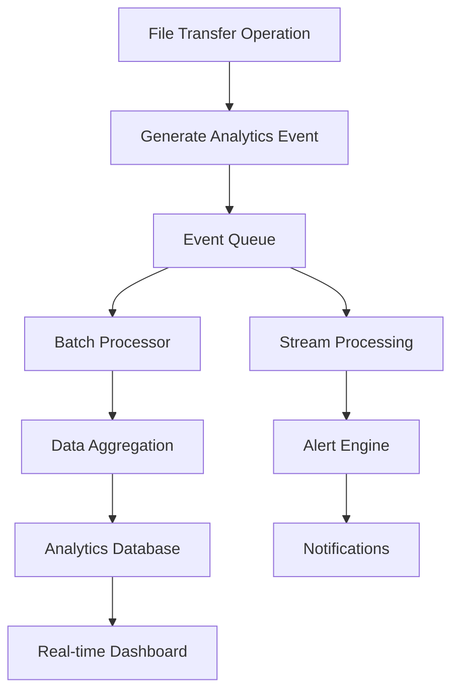
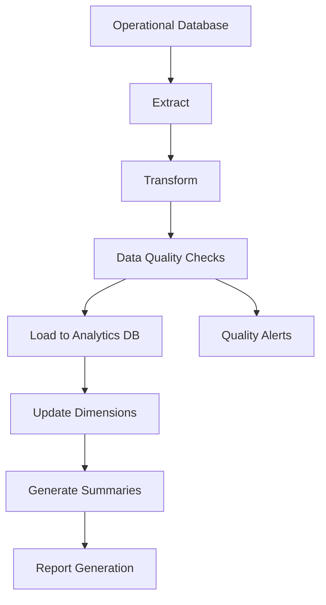
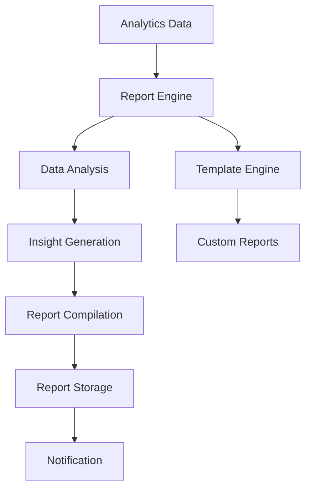

# Analytics and Business Intelligence Implementation Guide

## Overview

This document provides a comprehensive guide to the Advanced Analytics and Business Intelligence system implemented for the File Transfer Management System. The solution provides real-time analytics, historical analysis, predictive insights, and comprehensive business intelligence reporting.

## Table of Contents

1. [Architecture Overview](#architecture-overview)
2. [Core Components](#core-components)
3. [Data Models](#data-models)
4. [Analytics Processing Pipeline](#analytics-processing-pipeline)
5. [Business Intelligence Features](#business-intelligence-features)
6. [Real-time Analytics](#real-time-analytics)
7. [Predictive Analytics](#predictive-analytics)
8. [Data Warehouse](#data-warehouse)
9. [Frontend Dashboard](#frontend-dashboard)
10. [API Reference](#api-reference)
11. [Configuration](#configuration)
12. [Performance Optimization](#performance-optimization)
13. [Security and Compliance](#security-and-compliance)
14. [Monitoring and Alerting](#monitoring-and-alerting)
15. [Deployment Guide](#deployment-guide)
16. [Troubleshooting](#troubleshooting)

## Architecture Overview

### System Architecture

```
┌─────────────────────────────────────────────────────────────────────────────┐
│                        ANALYTICS & BUSINESS INTELLIGENCE                    │
├─────────────────────────────────────────────────────────────────────────────┤
│                                                                             │
│  ┌─────────────────┐    ┌─────────────────┐    ┌─────────────────┐         │
│  │   REAL-TIME     │    │   DATA          │    │   BUSINESS      │         │
│  │   ANALYTICS     │    │   WAREHOUSE     │    │   INTELLIGENCE  │         │
│  │                 │    │                 │    │                 │         │
│  │ • Event Stream  │    │ • ETL Pipeline  │    │ • Report Engine │         │
│  │ • Processing    │    │ • Data Quality  │    │ • Insights      │         │
│  │ • Aggregation   │    │ • Dimensional   │    │ • Predictions   │         │
│  │ • Dashboards    │    │   Modeling      │    │ • Recommendations│        │
│  └─────────────────┘    └─────────────────┘    └─────────────────┘         │
│           │                       │                       │                 │
│           └───────────────────────┼───────────────────────┘                 │
│                                   │                                         │
│  ┌─────────────────────────────────┼─────────────────────────────────────┐   │
│  │                    DATA STORAGE LAYER                                │   │
│  │                                                                     │   │
│  │  ┌─────────────┐  ┌─────────────┐  ┌─────────────┐  ┌─────────────┐ │   │
│  │  │ Operational │  │ Analytics   │  │ Event       │  │ Report      │ │   │
│  │  │ Database    │  │ Warehouse   │  │ Store       │  │ Cache       │ │   │
│  │  │ (Primary)   │  │ (Aggregated)│  │ (Real-time) │  │ (Generated) │ │   │
│  │  └─────────────┘  └─────────────┘  └─────────────┘  └─────────────┘ │   │
│  └─────────────────────────────────────────────────────────────────────┘   │
│                                   │                                         │
│  ┌─────────────────────────────────┼─────────────────────────────────────┐   │
│  │                    API LAYER & SERVICES                              │   │
│  │                                                                     │   │
│  │  ┌─────────────┐  ┌─────────────┐  ┌─────────────┐  ┌─────────────┐ │   │
│  │  │ Analytics   │  │ BI Service  │  │ Data        │  │ Predictive  │ │   │
│  │  │ Data        │  │             │  │ Warehouse   │  │ Analytics   │ │   │
│  │  │ Service     │  │             │  │ Service     │  │ Service     │ │   │
│  │  └─────────────┘  └─────────────┘  └─────────────┘  └─────────────┘ │   │
│  └─────────────────────────────────────────────────────────────────────┘   │
│                                   │                                         │
│  ┌─────────────────────────────────┼─────────────────────────────────────┐   │
│  │                    FRONTEND LAYER                                    │   │
│  │                                                                     │   │
│  │  ┌─────────────┐  ┌─────────────┐  ┌─────────────┐  ┌─────────────┐ │   │
│  │  │ Analytics   │  │ Real-time   │  │ Business    │  │ Predictive  │ │   │
│  │  │ Dashboard   │  │ Dashboard   │  │ Reports     │  │ Insights    │ │   │
│  │  └─────────────┘  └─────────────┘  └─────────────┘  └─────────────┘ │   │
│  └─────────────────────────────────────────────────────────────────────┘   │
└─────────────────────────────────────────────────────────────────────────────┘
```

### Key Benefits

- **📊 Comprehensive Analytics**: Complete view of file transfer operations
- **⚡ Real-time Insights**: Live monitoring and immediate alerts
- **🔮 Predictive Capabilities**: Forecasting and capacity planning
- **📈 Business Intelligence**: Strategic insights and recommendations
- **🎯 Performance Optimization**: Data-driven optimization opportunities
- **💰 Cost Management**: Detailed cost analysis and optimization
- **🔍 Data Quality**: Continuous data quality monitoring
- **📱 Mobile-Responsive**: Works on all devices and screen sizes

## Core Components

### 1. Analytics Data Service

**Location**: `com.filetransfer.web.analytics.service.AnalyticsDataService`

**Responsibilities**:
- Real-time event processing
- Data aggregation and metrics calculation
- Historical data analysis
- Dashboard data preparation

**Key Features**:
```java
// Record real-time analytics events
analyticsDataService.recordAnalyticsEvent(
    tenantId, eventType, serviceName, subServiceName,
    fileName, fileSizeBytes, processingTimeMs, status,
    errorCode, errorMessage, metadata
);

// Get comprehensive analytics summary
Map<String, Object> summary = analyticsDataService.getAnalyticsSummary(
    tenantId, startDate, endDate
);

// Get trending data for visualization
List<Map<String, Object>> trends = analyticsDataService.getTrendingAnalytics(
    tenantId, startDate, endDate, "daily"
);
```

### 2. Business Intelligence Service

**Location**: `com.filetransfer.web.analytics.service.BusinessIntelligenceService`

**Responsibilities**:
- Report generation and management
- Predictive analytics
- Capacity planning
- SLA compliance analysis
- Cost analysis

**Key Features**:
```java
// Generate comprehensive BI report
BusinessIntelligenceReport report = businessIntelligenceService.generateReport(
    tenantId, ReportType.MONTHLY_SUMMARY, startDate, endDate, createdBy
);

// Get predictive analytics
Map<String, Object> predictions = businessIntelligenceService.generatePredictiveAnalytics(
    tenantId, 30 // 30-day forecast
);

// Get capacity planning insights
Map<String, Object> capacityPlan = businessIntelligenceService.generateCapacityPlanningReport(
    tenantId, 6 // 6-month planning horizon
);
```

### 3. Data Warehouse Service

**Location**: `com.filetransfer.web.analytics.service.DataWarehouseService`

**Responsibilities**:
- ETL (Extract, Transform, Load) operations
- Data quality management
- Historical data processing
- Dimensional data modeling

**Key Features**:
- **Daily ETL Processing**: Automated daily data processing at 2:00 AM
- **Data Quality Checks**: Completeness, consistency, and accuracy validation
- **Data Retention Management**: Configurable data retention policies
- **Performance Optimization**: Batch processing and parallel execution

### 4. Analytics Controller

**Location**: `com.filetransfer.web.analytics.controller.AnalyticsController`

**Responsibilities**:
- REST API endpoints for analytics
- Request/response handling
- Authentication and authorization
- Error handling

## Data Models

### 1. File Transfer Analytics

**Entity**: `FileTransferAnalytics`

**Purpose**: Stores aggregated analytics data for business intelligence

**Key Fields**:
```java
public class FileTransferAnalytics {
    private Long id;
    private String tenantId;
    private String serviceName;
    private String subServiceName;
    private LocalDate analyticsDate;
    private TransferDirection direction;
    private FileType fileType;
    
    // Volume metrics
    private Long totalFiles;
    private Long successfulTransfers;
    private Long failedTransfers;
    private Long totalDataVolumeBytes;
    
    // Performance metrics
    private Double avgProcessingTimeMs;
    private Long minProcessingTimeMs;
    private Long maxProcessingTimeMs;
    private Long p95ProcessingTimeMs;
    private Long p99ProcessingTimeMs;
    
    // Quality metrics
    private Long validationErrors;
    private Long schemaValidationFailures;
    private Long fileCorruptionIncidents;
    
    // Business metrics
    private Long slaBreaches;
    private Long cutOffExtensions;
    private Long holidayProcessing;
    
    // Cost metrics
    private Double estimatedProcessingCost;
    private Double storageCost;
    private Double bandwidthCost;
}
```

### 2. Real-time Analytics Events

**Entity**: `RealTimeAnalyticsEvent`

**Purpose**: Stores individual events for real-time processing

**Key Fields**:
```java
public class RealTimeAnalyticsEvent {
    private Long id;
    private String tenantId;
    private AnalyticsEventType eventType;
    private LocalDateTime eventTimestamp;
    private String serviceName;
    private String subServiceName;
    private String fileName;
    private Long fileSizeBytes;
    private Long processingTimeMs;
    private TransferStatus transferStatus;
    private String errorCode;
    private String errorMessage;
    private String metadata; // JSON
    private Boolean processed;
}
```

### 3. Business Intelligence Reports

**Entity**: `BusinessIntelligenceReport`

**Purpose**: Stores pre-computed analytical reports

**Key Fields**:
```java
public class BusinessIntelligenceReport {
    private Long id;
    private String tenantId;
    private ReportType reportType;
    private String reportName;
    private LocalDate reportPeriodStart;
    private LocalDate reportPeriodEnd;
    private String reportData; // JSON
    private String summaryMetrics; // JSON
    private String insights; // JSON
    private LocalDateTime generatedAt;
    private LocalDateTime expiresAt;
    private Long reportSizeBytes;
    private Long generationTimeMs;
    private String createdBy;
}
```

## Analytics Processing Pipeline

### 1. Real-time Event Processing



**Process Flow**:
1. **Event Generation**: File transfer operations generate analytics events
2. **Event Queuing**: Events are queued for batch processing
3. **Batch Processing**: Events are processed in batches every 5 minutes
4. **Data Aggregation**: Events are aggregated into analytics metrics
5. **Storage**: Aggregated data is stored in analytics database
6. **Real-time Updates**: Dashboards are updated with latest data

### 2. ETL Pipeline



**Daily ETL Process**:
1. **Extract**: Pull data from operational database
2. **Transform**: Convert to analytical format
3. **Quality Checks**: Validate data completeness and accuracy
4. **Load**: Store in analytics warehouse
5. **Dimensions**: Update dimensional data
6. **Summaries**: Generate daily summary statistics

### 3. Report Generation Pipeline



## Business Intelligence Features

### 1. Summary Analytics

**Metrics Provided**:
- **Volume Metrics**: Total files, successful/failed transfers, data volume
- **Performance Metrics**: Processing times, percentiles, throughput
- **Quality Metrics**: Validation errors, schema failures, data quality score
- **Business Metrics**: SLA compliance, cut-off extensions, holiday processing
- **Cost Metrics**: Processing costs, storage costs, bandwidth costs

**Example Response**:
```json
{
  "totalFiles": 15420,
  "successfulTransfers": 14892,
  "failedTransfers": 528,
  "successRate": 96.57,
  "totalDataVolumeBytes": 2847392847,
  "totalDataVolumeGB": 2.65,
  "avgProcessingTimeMs": 2847.5,
  "avgProcessingTimeSeconds": 2.85,
  "qualityScore": 94.2,
  "slaComplianceRate": 97.8,
  "totalEstimatedCost": 156.78,
  "periodStart": "2024-01-01",
  "periodEnd": "2024-01-31",
  "periodDays": 31
}
```

### 2. Trending Analytics

**Features**:
- **Time Series Data**: Daily, weekly, monthly trends
- **Multiple Metrics**: Volume, performance, quality trends
- **Comparative Analysis**: Period-over-period comparisons
- **Seasonal Analysis**: Identify seasonal patterns

**Example Response**:
```json
[
  {
    "date": "2024-01-01",
    "totalFiles": 487,
    "successfulTransfers": 471,
    "failedTransfers": 16,
    "totalDataVolumeBytes": 89472847,
    "avgProcessingTimeMs": 2847.5
  },
  {
    "date": "2024-01-02",
    "totalFiles": 523,
    "successfulTransfers": 508,
    "failedTransfers": 15,
    "totalDataVolumeBytes": 95847392,
    "avgProcessingTimeMs": 2654.8
  }
]
```

### 3. Service-Level Analytics

**Features**:
- **Service Breakdown**: Analytics by service and sub-service
- **Performance Comparison**: Compare service performance
- **Resource Utilization**: Service-level resource usage
- **Error Analysis**: Service-specific error patterns

### 4. Predictive Analytics

**Capabilities**:
- **Volume Forecasting**: Predict future file transfer volumes
- **Performance Prediction**: Forecast processing times and bottlenecks
- **Capacity Planning**: Resource requirement predictions
- **Anomaly Detection**: Identify unusual patterns and outliers
- **Cost Forecasting**: Predict future costs and optimization opportunities

**Example Prediction Response**:
```json
{
  "volumePredictions": {
    "forecast": [
      {
        "date": "2024-02-01",
        "predictedFiles": 520,
        "confidenceInterval": [480, 560],
        "trend": "increasing"
      }
    ],
    "accuracy": 0.87,
    "model": "ARIMA"
  },
  "recommendations": [
    {
      "priority": "HIGH",
      "category": "CAPACITY",
      "recommendation": "Increase processing capacity by 20% for February",
      "estimatedImpact": "Prevent 15% performance degradation"
    }
  ]
}
```

## Real-time Analytics

### 1. Real-time Dashboard

**Features**:
- **Live Metrics**: Current processing status and queue length
- **Recent Activity**: Last hour and 24-hour summaries
- **Error Monitoring**: Real-time error tracking and alerts
- **Performance Monitoring**: Current throughput and response times

### 2. Event Types

**Supported Events**:
```java
public enum AnalyticsEventType {
    FILE_UPLOAD_STARTED,
    FILE_UPLOAD_COMPLETED,
    FILE_UPLOAD_FAILED,
    FILE_PROCESSING_STARTED,
    FILE_PROCESSING_COMPLETED,
    FILE_PROCESSING_FAILED,
    VALIDATION_STARTED,
    VALIDATION_COMPLETED,
    VALIDATION_FAILED,
    SCHEMA_VALIDATION_FAILED,
    CUT_OFF_EXTENSION_REQUESTED,
    CUT_OFF_EXTENSION_APPROVED,
    SLA_BREACH_DETECTED,
    SYSTEM_ERROR,
    PERFORMANCE_ANOMALY,
    SECURITY_INCIDENT
}
```

### 3. Real-time Processing

**Configuration**:
```yaml
analytics:
  real-time:
    enabled: true
    processing-interval-seconds: 300  # Process every 5 minutes
    batch-size: 1000                  # Process 1000 events at a time
    max-processing-threads: 4         # 4 parallel processing threads
```

## Frontend Dashboard

### 1. Analytics Dashboard Component

**Location**: `file-transfer-frontend/src/components/analytics/AnalyticsDashboard.js`

**Features**:
- **Multi-tab Interface**: Overview, Real-time, Predictive tabs
- **Interactive Charts**: Line charts, bar charts, pie charts
- **Responsive Design**: Works on desktop, tablet, and mobile
- **Real-time Updates**: Automatic refresh of real-time data
- **Export Functionality**: Export data to CSV format
- **Date Range Selection**: Flexible date range filtering

### 2. Chart Types

**Supported Visualizations**:
- **Line Charts**: Trending data over time
- **Bar Charts**: Service performance comparisons
- **Pie Charts**: Distribution analysis
- **Area Charts**: Volume trends with forecasting
- **Gauge Charts**: Performance indicators and scores

### 3. Mobile Responsiveness

**Features**:
- **Adaptive Layout**: Adjusts to screen size
- **Touch-Friendly**: Optimized for touch interactions
- **Scrollable Tabs**: Horizontal scrolling on mobile
- **Condensed Views**: Compact display for small screens

## API Reference

### 1. Analytics Summary

```http
GET /api/v1/analytics/summary
```

**Parameters**:
- `tenantId` (required): Tenant identifier
- `startDate` (required): Start date (YYYY-MM-DD)
- `endDate` (required): End date (YYYY-MM-DD)

**Response**: Analytics summary object

### 2. Trending Analytics

```http
GET /api/v1/analytics/trends
```

**Parameters**:
- `tenantId` (required): Tenant identifier
- `startDate` (required): Start date (YYYY-MM-DD)
- `endDate` (required): End date (YYYY-MM-DD)
- `granularity` (optional): daily, weekly, monthly (default: daily)

**Response**: Array of trend data points

### 3. Real-time Dashboard

```http
GET /api/v1/analytics/realtime/dashboard
```

**Parameters**:
- `tenantId` (required): Tenant identifier

**Response**: Real-time dashboard data

### 4. Predictive Analytics

```http
GET /api/v1/analytics/predictive
```

**Parameters**:
- `tenantId` (required): Tenant identifier
- `forecastDays` (optional): Number of days to forecast (default: 30)

**Response**: Predictive analytics data

### 5. Generate Report

```http
POST /api/v1/analytics/reports/generate
```

**Parameters**:
- `tenantId` (required): Tenant identifier
- `reportType` (required): Report type enum
- `startDate` (required): Start date (YYYY-MM-DD)
- `endDate` (required): End date (YYYY-MM-DD)
- `createdBy` (required): User identifier

**Response**: Report generation future

### 6. Export Data

```http
GET /api/v1/analytics/export
```

**Parameters**:
- `tenantId` (required): Tenant identifier
- `startDate` (required): Start date (YYYY-MM-DD)
- `endDate` (required): End date (YYYY-MM-DD)
- `format` (optional): Export format (default: csv)

**Response**: File download

## Configuration

### 1. Application Configuration

**File**: `application-analytics.yml`

**Key Sections**:
- **Real-time Processing**: Event processing configuration
- **Data Warehouse**: ETL and data management settings
- **Business Intelligence**: Report generation and BI settings
- **Performance**: Caching and optimization settings
- **Security**: Data protection and access control
- **Monitoring**: Health checks and alerting

### 2. Database Configuration

**Analytics Tables**:
- `file_transfer_analytics`: Aggregated analytics data
- `real_time_analytics_events`: Real-time event stream
- `business_intelligence_reports`: Generated reports

**Indexes**:
- Tenant and date range indexes for fast querying
- Service and sub-service indexes for breakdown analysis
- Time-series indexes for trending analysis

### 3. Cache Configuration

**Cache Strategy**:
- **Summary Data**: 30-minute TTL
- **Trend Data**: 1-hour TTL
- **Real-time Data**: 5-minute TTL
- **Report Data**: 2-hour TTL

## Performance Optimization

### 1. Database Optimization

**Strategies**:
- **Partitioning**: Date-based partitioning for large tables
- **Indexing**: Optimized indexes for common query patterns
- **Connection Pooling**: Dedicated connection pool for analytics
- **Query Optimization**: Efficient aggregation queries

### 2. Caching Strategy

**Multi-Level Caching**:
- **Application Cache**: In-memory caching for frequently accessed data
- **Distributed Cache**: Redis for shared cache across instances
- **Query Cache**: Database query result caching
- **Report Cache**: Pre-computed report caching

### 3. Async Processing

**Benefits**:
- **Non-blocking**: Analytics processing doesn't block main operations
- **Scalable**: Independent scaling of analytics processing
- **Resilient**: Fault tolerance with retry mechanisms
- **Efficient**: Batch processing for better throughput

## Security and Compliance

### 1. Data Security

**Features**:
- **Encryption**: Data encryption at rest and in transit
- **Access Control**: Role-based access to analytics data
- **Audit Logging**: Complete audit trail for analytics access
- **Tenant Isolation**: Strict tenant data separation

### 2. Privacy Compliance

**Capabilities**:
- **Data Anonymization**: Optional data anonymization
- **Data Masking**: Sensitive data masking options
- **GDPR Compliance**: GDPR-compliant data handling
- **Data Retention**: Configurable data retention policies

### 3. API Security

**Security Measures**:
- **Authentication**: JWT-based authentication
- **Authorization**: Role-based API access control
- **Rate Limiting**: API rate limiting per tenant
- **Input Validation**: Comprehensive input validation

## Monitoring and Alerting

### 1. System Health Monitoring

**Health Checks**:
- **Database Connectivity**: Analytics database health
- **Cache Connectivity**: Cache system health
- **Processing Pipeline**: ETL and processing health
- **Data Freshness**: Data recency monitoring

### 2. Performance Monitoring

**Metrics**:
- **Processing Lag**: Event processing delay
- **Query Performance**: Analytics query response times
- **Cache Performance**: Cache hit ratios and performance
- **Resource Utilization**: CPU, memory, and storage usage

### 3. Alerting Configuration

**Alert Types**:
- **Data Quality Alerts**: Data completeness and accuracy issues
- **Performance Alerts**: Slow processing or high latency
- **System Alerts**: System failures or degradation
- **Business Alerts**: SLA breaches or anomalies

**Alert Channels**:
- **Email**: Email notifications for critical alerts
- **Slack**: Slack integration for team notifications
- **Webhook**: Custom webhook integrations
- **Dashboard**: In-app alert notifications

## Deployment Guide

### 1. Prerequisites

**Requirements**:
- **Database**: PostgreSQL 13+ or SQL Server 2019+
- **Cache**: Redis 6+ for caching
- **Java**: JDK 17+
- **Node.js**: Node.js 18+ for frontend
- **Memory**: Minimum 4GB RAM for analytics processing
- **Storage**: SSD storage recommended for performance

### 2. Configuration Steps

1. **Database Setup**:
   ```sql
   -- Create analytics database schema
   CREATE SCHEMA analytics;
   
   -- Run migration scripts
   ./scripts/run-analytics-migrations.sh
   ```

2. **Application Configuration**:
   ```yaml
   # Enable analytics module
   spring:
     profiles:
       active: production,analytics
   
   # Configure analytics settings
   analytics:
     enabled: true
     real-time:
       enabled: true
   ```

3. **Cache Setup**:
   ```bash
   # Start Redis for caching
   redis-server --port 6379
   ```

### 3. Verification Steps

1. **Health Check**:
   ```bash
   curl http://localhost:8080/actuator/health/analytics
   ```

2. **API Test**:
   ```bash
   curl "http://localhost:8080/api/v1/analytics/summary?tenantId=demo&startDate=2024-01-01&endDate=2024-01-31"
   ```

3. **Frontend Access**:
   Navigate to `http://localhost:3000/analytics` to access the dashboard

## Troubleshooting

### 1. Common Issues

**Issue**: Analytics data not updating
**Solution**: 
- Check ETL job status in logs
- Verify database connectivity
- Check processing queue status

**Issue**: Slow dashboard performance
**Solution**:
- Enable caching configuration
- Check database query performance
- Optimize date range queries

**Issue**: Report generation failures
**Solution**:
- Check report generation logs
- Verify sufficient memory allocation
- Check data availability for report period

### 2. Performance Issues

**Symptom**: High memory usage
**Cause**: Large dataset processing without proper batching
**Solution**: Configure appropriate batch sizes and enable streaming

**Symptom**: Slow query performance
**Cause**: Missing or inefficient database indexes
**Solution**: Add appropriate indexes and optimize queries

### 3. Data Quality Issues

**Symptom**: Missing analytics data
**Cause**: ETL process failures or data source issues
**Solution**: Check ETL logs and verify data source connectivity

**Symptom**: Inconsistent metrics
**Cause**: Data synchronization issues or processing errors
**Solution**: Run data quality checks and re-process affected periods

## Best Practices

### 1. Data Management

- **Regular Cleanup**: Implement data retention policies
- **Data Quality**: Monitor data quality metrics continuously
- **Backup Strategy**: Regular backups of analytics data
- **Capacity Planning**: Monitor storage growth and plan capacity

### 2. Performance Optimization

- **Query Optimization**: Regular query performance reviews
- **Index Maintenance**: Regular index optimization
- **Cache Strategy**: Optimize cache configuration for workload
- **Resource Monitoring**: Continuous resource utilization monitoring

### 3. Security

- **Access Control**: Regular access control reviews
- **Data Encryption**: Ensure encryption for sensitive data
- **Audit Logging**: Comprehensive audit logging
- **Compliance**: Regular compliance reviews and updates

## Conclusion

The Analytics and Business Intelligence system provides comprehensive insights into file transfer operations with real-time monitoring, predictive capabilities, and detailed business intelligence reporting. The system is designed for scalability, performance, and enterprise-grade requirements while maintaining data quality and security standards.

For additional support or questions, please refer to the system documentation or contact the development team.