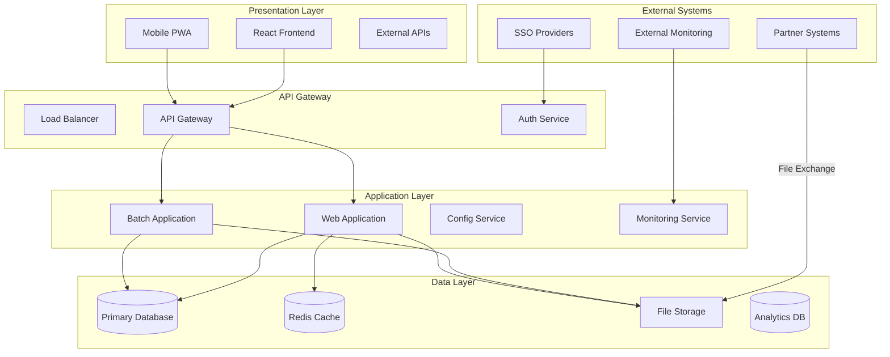

# File Transfer Management System - High Level Design (HLD)

## 1. Document Overview

### 1.1 Purpose
This High Level Design document provides a comprehensive overview of the File Transfer Management System architecture, including system components, data flow, interfaces, and key design decisions.

### 1.2 Scope
- System architecture and component design
- Data flow and integration patterns
- Security and performance considerations
- Deployment and operational aspects

### 1.3 Audience
- Solution Architects
- Technical Leads
- Development Teams
- DevOps Engineers
- Product Managers

## 2. System Context

### 2.1 Business Context
The File Transfer Management System enables automated, secure, and monitored file exchanges between business partners with full acknowledgment tracking and enterprise-grade features.

### 2.2 Technical Context
- **Platform**: Multi-tenant SaaS platform
- **Deployment**: Cloud-native Kubernetes deployment
- **Integration**: RESTful APIs and file-based exchanges
- **Scale**: Enterprise-scale with high availability requirements

## 3. Architectural Overview

### 3.1 System Architecture Diagram



### 3.2 Component Responsibilities

#### Frontend Applications
- **React Web Application**: Primary user interface for desktop users
- **Mobile PWA**: Mobile-optimized progressive web application
- **External API Clients**: Third-party integrations and partner systems

#### Backend Applications
- **Web Application**: REST API services, business logic, real-time operations
- **Batch Application**: File processing, scheduled jobs, bulk operations
- **Config Service**: Centralized configuration management
- **Monitoring Service**: System monitoring and alerting

#### Data Components
- **Primary Database**: Transactional data storage with multi-tenant support
- **Cache Layer**: High-performance caching for frequently accessed data
- **File Storage**: Secure file storage with backup and archival
- **Analytics Database**: Data warehouse for reporting and analytics

## 4. Detailed Component Design

### 4.1 Frontend Application (React)

#### Architecture Pattern: Component-Based Architecture

```
┌─────────────────────────────────────────────────────────────────┐
│                        React Application                        │
├─────────────────────────────────────────────────────────────────┤
│  App Router                                                     │
│  ├── Public Routes (Login, SSO)                               │
│  └── Protected Routes (Dashboard, Management)                  │
├─────────────────────────────────────────────────────────────────┤
│  Feature Modules                                               │
│  ├── FileTransfer (List, Details, Actions)                    │
│  ├── AckNack (Management, Upload, Statistics)                 │
│  ├── ServiceConfig (CRUD, Testing, Validation)               │
│  ├── TenantMgmt (Multi-tenant switching)                     │
│  ├── Analytics (Dashboards, Reports)                         │
│  └── Admin (User management, System config)                  │
├─────────────────────────────────────────────────────────────────┤
│  Shared Services                                               │
│  ├── API Service (HTTP client, error handling)               │
│  ├── Auth Service (JWT, SSO, session management)             │
│  ├── Notification Service (Toasts, alerts)                   │
│  ├── Theme Service (Dark/light mode, responsive)             │
│  └── Storage Service (Local storage, cache)                  │
├─────────────────────────────────────────────────────────────────┤
│  Infrastructure                                                │
│  ├── State Management (Context API, Hooks)                   │
│  ├── Routing (React Router)                                  │
│  ├── UI Framework (Material-UI)                              │
│  └── PWA Features (Service Worker, Offline)                  │
└─────────────────────────────────────────────────────────────────┘
```

#### Key Design Decisions
- **State Management**: Context API for global state, local state for component-specific data
- **Component Strategy**: Functional components with hooks for better performance
- **Styling**: Material-UI with custom theming for brand consistency
- **Performance**: Code splitting, lazy loading, memoization for large datasets

### 4.2 Web Application (Spring Boot)

#### Architecture Pattern: Layered Architecture with Domain-Driven Design

```
┌─────────────────────────────────────────────────────────────────┐
│                      Presentation Layer                         │
├─────────────────────────────────────────────────────────────────┤
│  REST Controllers                                               │
│  ├── FileTransferController (CRUD operations)                  │
│  ├── AckNackController (Acknowledgment management)             │
│  ├── ServiceConfigController (Service configuration)           │
│  ├── TenantController (Tenant management)                      │
│  ├── AlertController (Alert management)                        │
│  └── AnalyticsController (Reporting and analytics)             │
├─────────────────────────────────────────────────────────────────┤
│                       Application Layer                         │
├─────────────────────────────────────────────────────────────────┤
│  Application Services                                           │
│  ├── FileTransferManagementService                            │
│  ├── AckNackService                                           │
│  ├── EotValidationService                                     │
│  ├── AlertService                                             │
│  ├── TenantService                                            │
│  └── SecurityService                                          │
├─────────────────────────────────────────────────────────────────┤
│                        Domain Layer                             │
├─────────────────────────────────────────────────────────────────┤
│  Domain Services                                               │
│  ├── FileValidationService                                    │
│  ├── SchemaValidationService                                  │
│  ├── CutOffTimeService                                        │
│  ├── HolidayService                                           │
│  ├── EncryptionService                                        │
│  └── CompressionService                                       │
├─────────────────────────────────────────────────────────────────┤
│                    Infrastructure Layer                         │
├─────────────────────────────────────────────────────────────────┤
│  Data Access Layer                                             │
│  ├── JPA Repositories                                         │
│  ├── Custom Query Implementations                             │
│  ├── Database Connection Management                           │
│  └── Transaction Management                                   │
│                                                                │
│  External Service Integration                                  │
│  ├── SSO Provider Integration                                 │
│  ├── File System Access                                       │
│  ├── Email/SMS Services                                       │
│  └── Cloud Service Integration                                │
└─────────────────────────────────────────────────────────────────┘
```

#### Key Design Patterns
- **Repository Pattern**: Data access abstraction
- **Service Layer Pattern**: Business logic encapsulation
- **DTO Pattern**: Data transfer between layers
- **Strategy Pattern**: Pluggable validation and processing strategies
- **Observer Pattern**: Event-driven notifications and updates

### 4.3 Batch Application (Spring Boot)

#### Architecture Pattern: Batch Processing with Pipeline Architecture

```
┌─────────────────────────────────────────────────────────────────┐
│                      Batch Orchestration                        │
├─────────────────────────────────────────────────────────────────┤
│  Job Scheduler                                                  │
│  ├── File Monitoring Jobs (Every 30 seconds)                  │
│  ├── ACK/NACK Processing Jobs (Every 60 seconds)              │
│  ├── EOT Validation Jobs (Every 5 minutes)                    │
│  ├── Backup Jobs (Daily)                                      │
│  └── Cleanup Jobs (Weekly)                                    │
├─────────────────────────────────────────────────────────────────┤
│                      Processing Pipeline                        │
├─────────────────────────────────────────────────────────────────┤
│  File Processing Pipeline                                       │
│  ├── File Reader (Multi-format support)                       │
│  ├── Validation Processor (Schema, format validation)         │
│  ├── Transformation Processor (Data conversion)               │
│  ├── Business Logic Processor (Rules application)             │
│  └── File Writer (Database, file system)                      │
│                                                                │
│  ACK/NACK Processing Pipeline                                  │
│  ├── ACK/NACK File Reader                                     │
│  ├── ACK/NACK Processor (Parsing, validation)                │
│  └── ACK/NACK Writer (Status updates, archival)              │
├─────────────────────────────────────────────────────────────────┤
│                        Service Layer                            │
├─────────────────────────────────────────────────────────────────┤
│  Core Services                                                  │
│  ├── FileTransferService                                      │
│  ├── AckNackService                                           │
│  ├── FileMonitoringService                                    │
│  ├── ValidationService                                        │
│  └── BackupService                                            │
├─────────────────────────────────────────────────────────────────┤
│                    Infrastructure Layer                         │
├─────────────────────────────────────────────────────────────────┤
│  ├── File System Integration                                  │
│  ├── Database Access                                          │
│  ├── External System Integration                              │
│  └── Monitoring and Logging                                   │
└─────────────────────────────────────────────────────────────────┘
```

## 5. Data Architecture

### 5.1 Database Design Philosophy

#### Multi-Tenant Data Model
```sql
-- All tables include tenant_id for data isolation
CREATE TABLE file_transfer_records (
    id BIGINT PRIMARY KEY,
    tenant_id VARCHAR(100) NOT NULL,
    -- other fields
    INDEX idx_tenant_id (tenant_id)
);
```

#### Entity Relationship Overview
```
Tenants (1) ──→ (N) ServiceConfigurations
                      │
                      ▼
ServiceConfigurations (1) ──→ (N) FileTransferRecords
                                     │
                                     ▼
FileTransferRecords (1) ──→ (0..1) AckNackRecords
```

### 5.2 Data Flow Design

#### File Processing Data Flow
```
File Arrival ──→ File Detection ──→ Decompression ──→ Validation ──→ Processing ──→ Compression ──→ Completion
     │                │               │               │             │             │             │
     ▼                ▼               ▼               ▼             ▼             ▼             ▼
File Metadata ──→ Transfer Record ──→ File Extract ──→ Validation ──→ Status ──→ File Package ──→ ACK/NACK
                                                     Results       Updates                     Generation
```

#### ACK/NACK Data Flow
```
Inbound Files ──→ Processing ──→ ACK/NACK ──→ Partner ──→ Confirmation
                      │         Generation    Delivery
                      ▼
Outbound Files ──→ Partner ──→ ACK/NACK ──→ Reception ──→ Status Update
                              Reception
```

## 6. Interface Design

### 6.1 API Design Principles

#### RESTful API Design
- **Resource-Based URLs**: `/api/v1/file-transfers/{id}`
- **HTTP Methods**: GET, POST, PUT, DELETE for CRUD operations
- **Status Codes**: Proper HTTP status code usage
- **Content Negotiation**: JSON primary, XML support
- **Versioning**: URL-based versioning (/api/v1/, /api/v2/)

#### API Security
- **Authentication**: JWT Bearer tokens
- **Authorization**: Role-based access control
- **Rate Limiting**: Tenant-based rate limiting
- **Input Validation**: Comprehensive input sanitization

### 6.2 External Interfaces

#### Partner File Exchange
```
Partner System ←──→ Secure File Share ←──→ File Transfer System
                    (SFTP/FTPS)
```

#### SSO Integration
```
User ──→ Frontend ──→ SSO Provider ──→ JWT Token ──→ Backend APIs
```

## 7. Security Design

### 7.1 Security Architecture

#### Defense in Depth Strategy
```
External Threats ──→ WAF ──→ Load Balancer ──→ API Gateway ──→ Applications
                      │         │              │              │
                      ▼         ▼              ▼              ▼
                 DDoS Protection  SSL          JWT Auth    Input Validation
                                              Rate Limiting   RBAC
```

#### Security Controls
1. **Network Security**: Firewall, VPN, network segmentation
2. **Application Security**: Authentication, authorization, input validation
3. **Data Security**: Encryption at rest and in transit, data masking
4. **Operational Security**: Logging, monitoring, incident response

### 7.2 Multi-Tenant Security

#### Tenant Isolation Mechanisms
- **Data Isolation**: Tenant ID in all database queries
- **Processing Isolation**: Tenant-specific queues and workers
- **Configuration Isolation**: Tenant-scoped configurations
- **Resource Isolation**: Kubernetes namespaces (enterprise tier)

## 8. Performance Design

### 8.1 Performance Architecture

#### Scalability Patterns
```
Load Balancer ──→ Multiple Web App Instances ──→ Shared Database
                           │                        │
                           ▼                        ▼
                   Distributed Cache ──────→ Read Replicas
                           │
                           ▼
                   Background Jobs ──────→ Message Queue
```

#### Performance Optimization Strategies
1. **Caching**: Multi-level caching (Redis, application, browser)
2. **Database Optimization**: Proper indexing, query optimization, connection pooling
3. **Asynchronous Processing**: Non-blocking operations for long-running tasks
4. **Resource Management**: Connection pooling, thread pooling, memory management

### 8.2 Performance Requirements

#### Throughput Requirements
- **File Processing**: 10,000+ files per hour
- **API Requests**: 1,000+ requests per second
- **Concurrent Users**: 1,000+ simultaneous users
- **Database Queries**: 10,000+ queries per second

#### Latency Requirements
- **API Response Time**: < 500ms (95th percentile)
- **File Processing**: < 30 seconds for standard files
- **UI Response Time**: < 200ms for user interactions
- **Database Queries**: < 100ms for standard queries

## 9. Reliability and Availability Design

### 9.1 High Availability Architecture

#### Redundancy Strategy
```
Primary Site                    Secondary Site
├── Web App (2+ instances)     ├── Web App (Standby)
├── Batch App (1+ instances)   ├── Batch App (Standby)
├── Database (Primary)         ├── Database (Read Replica)
└── File Storage (Primary)     └── File Storage (Backup)
```

#### Failure Handling
- **Application Failures**: Health checks, automatic restart, circuit breakers
- **Database Failures**: Connection retry, read replica failover
- **File System Failures**: Backup storage, redundant storage
- **Network Failures**: Retry mechanisms, alternative paths

### 9.2 Disaster Recovery Design

#### Backup Strategy
- **Database Backups**: Daily full backup, hourly incremental
- **File Backups**: Real-time replication to secondary storage
- **Configuration Backups**: Version control with automated backups
- **Application Backups**: Container image versioning

#### Recovery Procedures
- **RTO (Recovery Time Objective)**: 4 hours for critical systems
- **RPO (Recovery Point Objective)**: 15 minutes for transactional data
- **Failover Process**: Automated failover with manual verification
- **Testing**: Monthly disaster recovery testing

## 10. Integration Design

### 10.1 Internal Integration Patterns

#### Synchronous Integration
- **REST APIs**: Real-time data exchange between frontend and backend
- **Database Transactions**: ACID compliance for data consistency
- **Caching**: Immediate cache updates for data consistency

#### Asynchronous Integration
- **File Processing**: Event-driven batch processing
- **Notifications**: Asynchronous alert and notification delivery
- **Background Jobs**: Scheduled and triggered background operations

### 10.2 External Integration Patterns

#### Partner Integration
```
Internal System ──→ Secure File Transfer ──→ Partner System
                    ├── SFTP/FTPS
                    ├── Secure File Shares
                    └── API Integration
```

#### Identity Provider Integration
```
User ──→ Frontend ──→ SSO Provider ──→ Token Validation ──→ Backend
                      ├── Azure AD
                      ├── Google
                      ├── Okta
                      └── Custom OIDC/SAML
```

## 11. Monitoring and Observability Design

### 11.1 Monitoring Architecture

#### Three Pillars of Observability
```
┌─────────────────┐ ┌─────────────────┐ ┌─────────────────┐
│     Metrics     │ │      Logs       │ │     Traces      │
│                 │ │                 │ │                 │
│  - Prometheus   │ │  - ELK Stack    │ │  - Jaeger       │
│  - Grafana      │ │  - Kibana       │ │  - OpenTelemetry│
│  - Custom       │ │  - Log Levels   │ │  - Distributed  │
│    Dashboards   │ │  - Structured   │ │    Tracing      │
└─────────────────┘ └─────────────────┘ └─────────────────┘
```

#### Monitoring Components
- **Application Metrics**: Business and technical KPIs
- **Infrastructure Metrics**: System resource utilization
- **Security Metrics**: Authentication and authorization events
- **User Experience Metrics**: Frontend performance and user behavior

### 11.2 Alerting Design

#### Alert Severity Levels
- **P1 (Critical)**: System down, data loss, security breach
- **P2 (High)**: Service degradation, processing failures
- **P3 (Medium)**: Performance issues, configuration problems
- **P4 (Low)**: Informational, maintenance notifications

#### Alert Routing
```
Alert Generation ──→ Alert Manager ──→ Notification Channels
                                       ├── Email
                                       ├── SMS
                                       ├── Slack
                                       └── PagerDuty
```

## 12. Deployment Design

### 12.1 Container Architecture

#### Multi-Stage Docker Builds
```dockerfile
# Example for Web Application
FROM maven:3.9-openjdk-17 AS builder
COPY . .
RUN mvn clean package -DskipTests

FROM openjdk:17-jre-slim
COPY --from=builder /target/app.jar app.jar
EXPOSE 8080
CMD ["java", "-jar", "app.jar"]
```

#### Container Orchestration
```yaml
# Kubernetes Deployment Example
apiVersion: apps/v1
kind: Deployment
metadata:
  name: file-transfer-web
spec:
  replicas: 2
  selector:
    matchLabels:
      app: file-transfer-web
  template:
    metadata:
      labels:
        app: file-transfer-web
    spec:
      containers:
      - name: web-app
        image: file-transfer-web:latest
        ports:
        - containerPort: 8080
        env:
        - name: SPRING_PROFILES_ACTIVE
          value: "kubernetes,production"
```

### 12.2 Infrastructure as Code

#### Terraform Configuration
- **Azure Resources**: AKS cluster, SQL MI, storage accounts
- **Network Configuration**: VNets, subnets, security groups
- **Monitoring Setup**: Azure Monitor, Log Analytics
- **Security Configuration**: Key Vault, managed identities

#### Helm Charts
- **Application Deployment**: Standardized Kubernetes deployments
- **Configuration Management**: Environment-specific configurations
- **Secret Management**: Secure secret distribution
- **Service Mesh**: Istio configuration for advanced networking

## 13. Quality Attributes

### 13.1 Performance Characteristics

#### Scalability Metrics
- **Horizontal Scaling**: Linear scaling up to 10x load
- **Vertical Scaling**: Efficient resource utilization
- **Database Scaling**: Read replica support for analytics
- **Storage Scaling**: Unlimited file storage capacity

#### Performance Benchmarks
- **File Processing Rate**: 10,000+ files/hour
- **API Throughput**: 1,000+ requests/second
- **Database Performance**: 100ms average query time
- **UI Responsiveness**: < 200ms interaction response

### 13.2 Reliability Characteristics

#### Availability Targets
- **System Availability**: 99.9% uptime (8.76 hours downtime/year)
- **Planned Maintenance**: < 4 hours/month
- **Unplanned Downtime**: < 2 hours/month
- **Data Availability**: 99.99% (52.56 minutes downtime/year)

#### Error Handling
- **Graceful Degradation**: System continues operating with reduced functionality
- **Circuit Breakers**: Prevent cascading failures
- **Retry Mechanisms**: Automatic retry with exponential backoff
- **Fallback Procedures**: Alternative processing paths

## 14. Operational Design

### 14.1 DevOps Architecture

#### CI/CD Pipeline
```
Code Commit ──→ Build ──→ Test ──→ Security Scan ──→ Deploy ──→ Monitor
     │           │        │         │              │         │
     ▼           ▼        ▼         ▼              ▼         ▼
GitHub ──→ Azure DevOps ──→ Unit ──→ SonarQube ──→ AKS ──→ Grafana
                           Integration  OWASP ZAP   Helm   Prometheus
                           E2E Tests    Dependency         ELK Stack
                                       Check
```

#### Environment Strategy
- **Development**: Local development with Docker Compose
- **Testing**: Kubernetes cluster with test data
- **Staging**: Production-like environment for final testing
- **Production**: High-availability Kubernetes cluster

### 14.2 Maintenance and Operations

#### Operational Procedures
- **Deployment**: Blue-green deployments with zero downtime
- **Monitoring**: 24/7 monitoring with automated alerting
- **Backup**: Automated backup with regular restore testing
- **Security**: Regular security scans and vulnerability assessments

#### Maintenance Activities
- **Database Maintenance**: Index optimization, statistics updates
- **File Cleanup**: Automated cleanup of processed files
- **Log Management**: Log rotation and archival
- **Performance Tuning**: Regular performance analysis and optimization

## 15. Technology Decisions and Rationale

### 15.1 Technology Selection Criteria

#### Backend Framework: Spring Boot
- **Rationale**: Mature ecosystem, enterprise features, extensive documentation
- **Benefits**: Rapid development, production-ready features, community support
- **Trade-offs**: Learning curve for new developers, framework overhead

#### Frontend Framework: React
- **Rationale**: Component reusability, large ecosystem, performance
- **Benefits**: Developer productivity, rich UI libraries, SEO support
- **Trade-offs**: Complexity for simple UIs, frequent updates

#### Database: MySQL/SQL Server
- **Rationale**: ACID compliance, mature tooling, enterprise support
- **Benefits**: Data consistency, backup/recovery tools, performance tuning
- **Trade-offs**: Scaling limitations, license costs (SQL Server)

#### Container Platform: Kubernetes
- **Rationale**: Industry standard, cloud-agnostic, rich ecosystem
- **Benefits**: Scalability, reliability, operational efficiency
- **Trade-offs**: Complexity, learning curve, operational overhead

### 15.2 Architectural Trade-offs

#### Monolith vs Microservices
- **Current**: Modular monolith with microservice readiness
- **Future**: Gradual decomposition to microservices
- **Rationale**: Reduced complexity while maintaining flexibility

#### Synchronous vs Asynchronous
- **Real-time Operations**: Synchronous for immediate response
- **Batch Operations**: Asynchronous for scalability
- **Rationale**: Balance between responsiveness and scalability

## 16. Future Enhancements

### 16.1 Planned Improvements
- **Event Sourcing**: Complete event-driven architecture
- **GraphQL**: Flexible API queries for frontend optimization
- **Machine Learning**: Predictive analytics for file processing
- **Blockchain**: Immutable audit trail for compliance

### 16.2 Scalability Roadmap
- **Microservices**: Decompose monolith into focused services
- **Multi-Region**: Active-active deployment across regions
- **Serverless**: Azure Functions for event processing
- **Edge Computing**: Edge nodes for global file processing