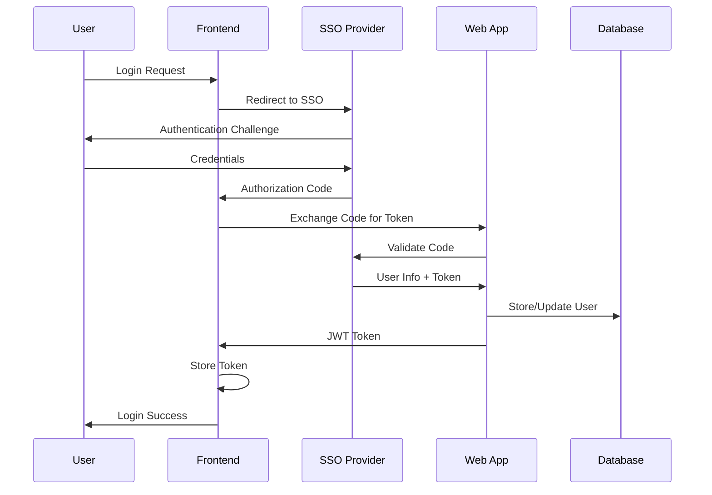
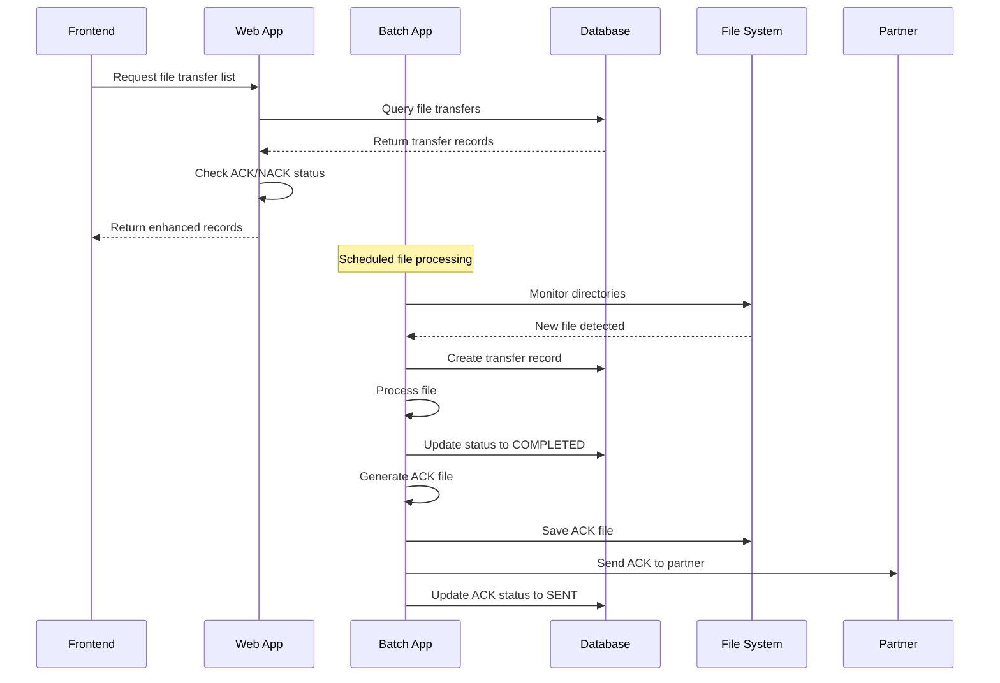
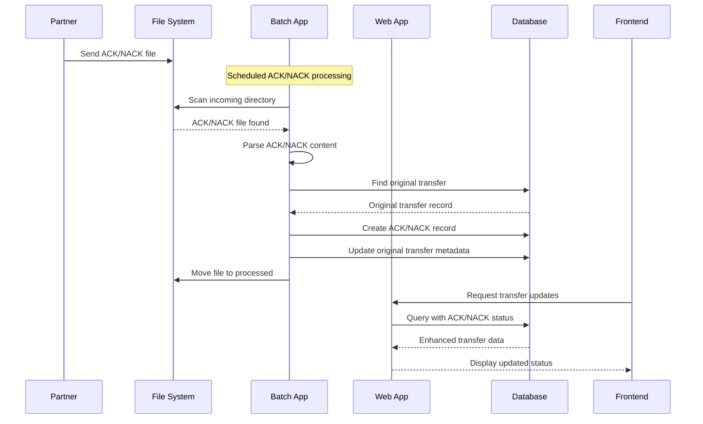
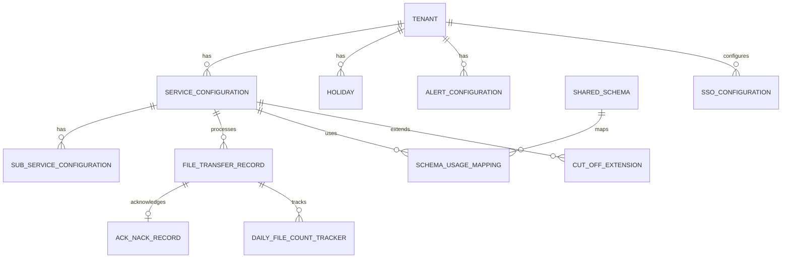

# File Transfer Web Application - Low Level Design (LLD)

## 1. Document Overview

### 1.1 Purpose
This document provides detailed low-level design specifications for the File Transfer Web Application, including class diagrams, sequence diagrams, database schemas, and implementation details.

### 1.2 Scope
- Detailed class and component design
- Database schema and relationships
- API specifications and contracts
- Security implementation details
- Performance optimization strategies

## 2. Application Structure

### 2.1 Package Structure
```
com.filetransfer.web/
├── FileTransferWebApplication.java     # Main application class
├── controller/                         # REST Controllers
│   ├── FileTransferController.java
│   ├── AckNackController.java
│   ├── ServiceConfigurationController.java
│   ├── TenantController.java
│   ├── AlertController.java
│   ├── SsoConfigurationController.java
│   ├── HolidayController.java
│   ├── SharedSchemaController.java
│   ├── ProcessingControlController.java
│   ├── BackupController.java
│   ├── SecurityController.java
│   ├── ApiVersionController.java
│   ├── AnalyticsController.java
│   └── CompressionController.java
├── service/                            # Business Logic Services
│   ├── FileTransferManagementService.java
│   ├── AckNackService.java
│   ├── EotValidationService.java
│   ├── AlertService.java
│   ├── TenantService.java
│   ├── SecurityService.java
│   ├── ServiceConfigurationService.java
│   ├── SsoConfigurationService.java
│   ├── HolidayService.java
│   ├── SharedSchemaService.java
│   ├── BackupService.java
│   ├── ProcessingControlService.java
│   ├── FileSchemaService.java
│   ├── FileTypeValidationService.java
│   ├── CutOffTimeService.java
│   ├── CutOffExtensionService.java
│   ├── InputValidationService.java
│   ├── EncryptionService.java
│   ├── MetricsService.java
│   ├── RateLimitingService.java
│   ├── LoadBalancingService.java
│   ├── AsyncProcessingService.java
│   ├── CrossApplicationIntegrationService.java
│   ├── CrossApplicationBackupService.java
│   ├── DisasterRecoveryService.java
│   ├── AlertingService.java
│   ├── CobolCopybookParser.java
│   ├── FileNamingConventionService.java
│   ├── FileProcessingTrackingService.java
│   ├── FileTypeSpecificValidator.java
│   ├── PerformanceOptimizedSubServiceService.java
│   ├── RetryableService.java
│   ├── SecurityContextService.java
│   ├── SubServiceConfigurationService.java
│   ├── SsoTestingService.java
│   ├── TenantTimeZoneService.java
│   ├── DatabaseAbstractionService.java
│   └── CompressionService.java
├── entity/                             # JPA Entities
│   ├── FileTransferRecord.java
│   ├── AckNackRecord.java
│   ├── ServiceConfiguration.java
│   ├── SubServiceConfiguration.java
│   ├── Tenant.java
│   ├── Holiday.java
│   ├── AlertConfiguration.java
│   ├── AlertHistory.java
│   ├── SsoConfiguration.java
│   ├── SharedSchema.java
│   ├── FileSchema.java
│   ├── SchemaField.java
│   ├── SchemaValidationRule.java
│   ├── SchemaUsageMapping.java
│   ├── SchemaUsageLog.java
│   ├── FileTypeSchemaMapping.java
│   ├── CutOffExtension.java
│   ├── DailyFileCountTracker.java
│   ├── TransferStatus.java (Enum)
│   ├── TransferDirection.java (Enum)
│   ├── FileType.java (Enum)
│   ├── AckNackStatus.java (Enum)
│   ├── AckNackType.java (Enum)
│   ├── CutOffTimeType.java (Enum)
│   └── CompressionType.java (Enum)
├── repository/                         # Data Access Layer
│   ├── FileTransferRecordRepository.java
│   ├── AckNackRecordRepository.java
│   ├── ServiceConfigurationRepository.java
│   ├── SubServiceConfigurationRepository.java
│   ├── TenantRepository.java
│   ├── HolidayRepository.java
│   ├── AlertConfigurationRepository.java
│   ├── AlertHistoryRepository.java
│   ├── SsoConfigurationRepository.java
│   ├── SharedSchemaRepository.java
│   ├── FileSchemaRepository.java
│   ├── SchemaFieldRepository.java
│   ├── SchemaValidationRuleRepository.java
│   ├── SchemaUsageMappingRepository.java
│   ├── SchemaUsageLogRepository.java
│   ├── FileTypeSchemaMappingRepository.java
│   ├── CutOffExtensionRepository.java
│   ├── DailyFileCountTrackerRepository.java
│   └── DatabaseSpecificTenantRepository.java
├── dto/                               # Data Transfer Objects
│   ├── FileTransferRecordDto.java
│   ├── AckNackRecordDto.java
│   ├── ServiceConfigurationDto.java
│   ├── TenantDto.java
│   ├── AlertConfigurationDto.java
│   └── SsoConfigurationDto.java
├── config/                            # Configuration Classes
│   ├── DatabaseConfiguration.java
│   ├── SecurityConfig.java
│   ├── CacheConfig.java
│   ├── ApiVersioningConfig.java
│   ├── RateLimitingFilter.java
│   ├── SecurityHeadersFilter.java
│   ├── InputValidationFilter.java
│   ├── DatabaseShardingConfig.java
│   └── EnhancedSecurityConfig.java
├── exception/                         # Exception Handling
│   ├── GlobalExceptionHandler.java
│   ├── FileProcessingException.java
│   ├── SubServiceException.java
│   ├── CutOffExtensionException.java
│   └── ValidationException.java
├── security/                          # Security Implementation
│   ├── JwtAuthenticationFilter.java
│   ├── SsoAuthenticationProvider.java
│   ├── TenantSecurityContext.java
│   └── RoleBasedAccessControl.java
├── versioning/                        # API Versioning
│   ├── ApiVersionResolver.java
│   ├── ApiVersionManager.java
│   ├── ApiVersion.java (Enum)
│   └── VersioningStrategy.java (Enum)
├── analytics/                         # Analytics Module
│   ├── controller/
│   │   └── AnalyticsController.java
│   ├── service/
│   │   ├── AnalyticsDataService.java
│   │   ├── BusinessIntelligenceService.java
│   │   └── DataWarehouseService.java
│   ├── model/
│   │   └── AnalyticsModels.java
│   └── repository/
│       ├── FileTransferAnalyticsRepository.java
│       ├── BusinessIntelligenceReportRepository.java
│       └── RealTimeAnalyticsEventRepository.java
└── model/                             # Domain Models
    └── backup/
        └── BackupModels.java
```

## 3. Detailed Class Design

### 3.1 Core Entity Classes

#### FileTransferRecord Entity
```java
@Entity
@Table(name = "file_transfer_records")
public class FileTransferRecord {
    @Id
    @GeneratedValue(strategy = GenerationType.IDENTITY)
    private Long id;
    
    @Column(nullable = false)
    private String fileName;
    
    @Column(name = "service_name", nullable = false)
    private String serviceName;
    
    @Column(name = "sub_service_name")
    private String subServiceName;
    
    @Column(nullable = false)
    private String tenantId;
    
    @Enumerated(EnumType.STRING)
    @Column(nullable = false)
    private TransferStatus status;
    
    @Enumerated(EnumType.STRING)
    @Column(nullable = false)
    private TransferDirection direction;
    
    @Enumerated(EnumType.STRING)
    @Column(nullable = false)
    private FileType fileType;
    
    // Additional fields for validation, metadata, timestamps
    // Full implementation in actual class file
}
```

#### AckNackRecord Entity
```java
@Entity
@Table(name = "ack_nack_records")
public class AckNackRecord {
    @Id
    @GeneratedValue(strategy = GenerationType.IDENTITY)
    private Long id;
    
    @Column(nullable = false)
    private Long originalFileTransferId;
    
    @Enumerated(EnumType.STRING)
    @Column(nullable = false)
    private AckNackType type;
    
    @Enumerated(EnumType.STRING)
    @Column(nullable = false)
    private AckNackStatus status;
    
    @Enumerated(EnumType.STRING)
    @Column(nullable = false)
    private TransferDirection direction;
    
    // Additional fields for content, paths, timestamps
    // Full implementation in actual class file
}
```

### 3.2 Service Layer Design

#### FileTransferManagementService
```java
@Service
@Transactional
public class FileTransferManagementService {
    
    @Autowired
    private FileTransferRecordRepository fileTransferRepository;
    
    @Autowired
    private AckNackService ackNackService;
    
    @Autowired
    private CompressionService compressionService;
    
    // Core CRUD operations
    public List<FileTransferRecordDto> getAllFileTransfers(String tenantId);
    public FileTransferRecordDto getFileTransferById(Long id);
    public void completeFileTransfer(Long id);
    public void failFileTransfer(Long id, String errorMessage);
    
    // Filter operations
    public List<FileTransferRecordDto> getFileTransfersByStatus(String tenantId, TransferStatus status);
    public List<FileTransferRecordDto> getFileTransfersByService(String tenantId, String serviceType);
    public List<FileTransferRecordDto> getFileTransfersByDirection(String tenantId, TransferDirection direction);
    
    // Management operations
    public void retryTransfer(Long id);
    public void cancelTransfer(Long id);
    public void generateAckForFile(Long id);
    public void generateNackForFile(Long id, String reasonCode, String reasonDescription);
    
    // Compression operations
    public void compressFile(Long id, CompressionType compressionType);
    public void decompressFile(Long id);
    public Map<String, Object> getCompressionRecommendations(Long id);
}
```

#### AckNackService
```java
@Service
@Transactional
public class AckNackService {
    
    @Autowired
    private AckNackRecordRepository ackNackRepository;
    
    @Autowired
    private FileTransferRecordRepository fileTransferRepository;
    
    // ACK/NACK generation
    public AckNackRecord generateAckForInboundFile(Long fileTransferId);
    public AckNackRecord generateNackForInboundFile(Long fileTransferId, String reasonCode, String reasonDescription);
    
    // ACK/NACK processing
    public AckNackRecord processReceivedAckNackFile(String filePath, String fileName, String tenantId);
    public void sendPendingAckNackFiles(String tenantId);
    
    // Query operations
    public List<AckNackRecordDto> getAllAckNackRecords(String tenantId);
    public List<AckNackRecordDto> getAckNackRecordsByStatus(String tenantId, AckNackStatus status);
    public Optional<AckNackRecordDto> getAckNackForFileTransfer(Long fileTransferId);
    
    // Management operations
    public void retryAckNack(Long ackNackId);
    public void markExpiredRecords();
}
```

#### CompressionService
```java
@Service
public class CompressionService {
    
    @Value("${file-transfer.compression.temp-dir:/tmp/compression}")
    private String tempCompressionDir;
    
    @Value("${file-transfer.compression.max-file-size-mb:1024}")
    private long maxFileSizeMB;
    
    @Value("${file-transfer.compression.default-type:GZIP}")
    private CompressionType defaultCompressionType;
    
    // Core compression operations
    public CompressionResult compressFile(Path sourceFile, CompressionType compressionType, String targetDirectory);
    public DecompressionResult decompressFile(Path compressedFile, String targetDirectory);
    
    // Analysis and recommendations
    public CompressionType getRecommendedCompression(Path file, FileType fileType, boolean prioritizeSpeed);
    public CompressionTestResult testCompressionEfficiency(Path file);
    
    // Helper methods
    private OutputStream createCompressorOutputStream(OutputStream outputStream, CompressionType type);
    private InputStream createDecompressorInputStream(InputStream inputStream, CompressionType type);
    private long performCompression(Path sourceFile, Path targetFile, CompressionType compressionType);
    private void performDecompression(Path compressedFile, Path targetFile, CompressionType compressionType);
}
```

## 4. Database Schema Design

### 4.1 Core Tables Schema

#### file_transfer_records
```sql
CREATE TABLE file_transfer_records (
    id BIGINT AUTO_INCREMENT PRIMARY KEY,
    file_name VARCHAR(255) NOT NULL,
    service_name VARCHAR(100) NOT NULL,
    sub_service_name VARCHAR(100),
    tenant_id VARCHAR(100) NOT NULL,
    source_path VARCHAR(500) NOT NULL,
    target_path VARCHAR(500) NOT NULL,
    status ENUM('PENDING','PROCESSING','IN_PROGRESS','PAUSED','COMPLETED','FAILED','CANCELLED','ARCHIVED','WAITING_FOR_END_MARKER') NOT NULL,
    direction ENUM('INBOUND','OUTBOUND') NOT NULL,
    file_type ENUM('COBOL_FLAT_FILE','BINARY_FILE','XML','JSON','CSV','FIXED_WIDTH','DELIMITED','EDI') NOT NULL DEFAULT 'COBOL_FLAT_FILE',
    schema_validation_passed BOOLEAN,
    schema_validation_errors TEXT,
    schema_id BIGINT,
    error_message TEXT,
    created_at TIMESTAMP NOT NULL DEFAULT CURRENT_TIMESTAMP,
    processed_at TIMESTAMP,
    processing_start_time TIMESTAMP,
    processing_end_time TIMESTAMP,
    file_size BIGINT,
    checksum VARCHAR(255),
    batch_job_execution_id VARCHAR(255),
    validation_result TEXT,
    metadata TEXT,
    compression_enabled BOOLEAN DEFAULT FALSE,
    compression_type ENUM('NONE','GZIP','ZIP','BZIP2','XZ','LZ4','ZSTD') DEFAULT 'NONE',
    original_file_size BIGINT,
    compressed_file_size BIGINT,
    compression_ratio FLOAT,
    compression_time_ms BIGINT,
    decompression_time_ms BIGINT,
    compressed_file_path VARCHAR(500),
    
    INDEX idx_tenant_id (tenant_id),
    INDEX idx_service_name (service_name),
    INDEX idx_status (status),
    INDEX idx_direction (direction),
    INDEX idx_created_at (created_at),
    INDEX idx_tenant_service (tenant_id, service_name),
    INDEX idx_tenant_status (tenant_id, status),
    INDEX idx_compression_enabled (compression_enabled),
    INDEX idx_compression_type (compression_type),
    INDEX idx_tenant_compression (tenant_id, compression_enabled)
);
```

#### ack_nack_records
```sql
CREATE TABLE ack_nack_records (
    id BIGINT AUTO_INCREMENT PRIMARY KEY,
    original_file_transfer_id BIGINT NOT NULL,
    original_file_name VARCHAR(255) NOT NULL,
    ack_nack_file_name VARCHAR(255) NOT NULL,
    type ENUM('ACK', 'NACK') NOT NULL,
    status ENUM('PENDING','GENERATED','SENT','RECEIVED','PROCESSED','FAILED','EXPIRED') NOT NULL,
    direction ENUM('INBOUND', 'OUTBOUND') NOT NULL,
    tenant_id VARCHAR(100) NOT NULL,
    service_name VARCHAR(100) NOT NULL,
    sub_service_name VARCHAR(100),
    ack_nack_file_path VARCHAR(500),
    partner_path VARCHAR(500),
    content TEXT,
    error_message TEXT,
    reason_code VARCHAR(50),
    reason_description TEXT,
    created_at TIMESTAMP NOT NULL DEFAULT CURRENT_TIMESTAMP,
    generated_at TIMESTAMP,
    sent_at TIMESTAMP,
    received_at TIMESTAMP,
    processed_at TIMESTAMP,
    expires_at TIMESTAMP,
    file_size BIGINT,
    checksum VARCHAR(255),
    metadata TEXT,
    
    CONSTRAINT fk_ack_nack_file_transfer 
        FOREIGN KEY (original_file_transfer_id) 
        REFERENCES file_transfer_records(id) 
        ON DELETE CASCADE,
        
    INDEX idx_original_file_transfer_id (original_file_transfer_id),
    INDEX idx_tenant_id (tenant_id),
    INDEX idx_status (status),
    INDEX idx_type (type),
    INDEX idx_expires_at (expires_at)
);
```

### 4.2 Configuration Tables

#### service_configurations
```sql
CREATE TABLE service_configurations (
    id BIGINT AUTO_INCREMENT PRIMARY KEY,
    tenant_id VARCHAR(100) NOT NULL,
    service_name VARCHAR(100) NOT NULL,
    sub_service_name VARCHAR(100),
    source_path VARCHAR(500) NOT NULL,
    target_path VARCHAR(500) NOT NULL,
    sot_file_pattern VARCHAR(255),
    data_file_pattern VARCHAR(255),
    eot_file_pattern VARCHAR(255),
    cut_off_time_type ENUM('DAILY','WEEKDAY_WEEKEND','PER_DAY') DEFAULT 'DAILY',
    daily_cut_off_time TIME,
    weekday_cut_off_time TIME,
    weekend_cut_off_time TIME,
    monday_cut_off_time TIME,
    tuesday_cut_off_time TIME,
    wednesday_cut_off_time TIME,
    thursday_cut_off_time TIME,
    friday_cut_off_time TIME,
    saturday_cut_off_time TIME,
    sunday_cut_off_time TIME,
    active BOOLEAN DEFAULT TRUE,
    description TEXT,
    created_at TIMESTAMP DEFAULT CURRENT_TIMESTAMP,
    updated_at TIMESTAMP DEFAULT CURRENT_TIMESTAMP ON UPDATE CURRENT_TIMESTAMP,
    
    UNIQUE KEY uk_service_config (tenant_id, service_name, sub_service_name),
    INDEX idx_tenant_active (tenant_id, active),
    INDEX idx_service_active (service_name, active)
);
```

## 5. API Design Specifications

### 5.1 File Transfer API

#### GET /api/v1/file-transfers/{tenantId}
```yaml
summary: Get all file transfer records for a tenant
parameters:
  - name: tenantId
    in: path
    required: true
    schema:
      type: string
responses:
  200:
    description: List of file transfer records
    content:
      application/json:
        schema:
          type: array
          items:
            $ref: '#/components/schemas/FileTransferRecordDto'
```

#### POST /api/v1/file-transfers/{id}/complete
```yaml
summary: Mark file transfer as completed
parameters:
  - name: id
    in: path
    required: true
    schema:
      type: integer
      format: int64
responses:
  200:
    description: Transfer completed successfully
  404:
    description: Transfer record not found
  400:
    description: Invalid transfer status for completion
```

### 5.2 ACK/NACK API

#### POST /api/v1/ack-nack/generate-ack/{fileTransferId}
```yaml
summary: Generate ACK file for successful inbound transfer
parameters:
  - name: fileTransferId
    in: path
    required: true
    schema:
      type: integer
      format: int64
responses:
  200:
    description: ACK generated successfully
    content:
      application/json:
        schema:
          type: object
          properties:
            message:
              type: string
            fileTransferId:
              type: string
```

#### POST /api/v1/ack-nack/generate-nack/{fileTransferId}
```yaml
summary: Generate NACK file for failed inbound transfer
parameters:
  - name: fileTransferId
    in: path
    required: true
    schema:
      type: integer
      format: int64
requestBody:
  required: true
  content:
    application/json:
      schema:
        type: object
        properties:
          reasonCode:
            type: string
          reasonDescription:
            type: string
        required:
          - reasonCode
```

### 5.3 Compression API

#### POST /api/v1/compression/compress/{fileTransferId}
```yaml
summary: Compress a file transfer
parameters:
  - name: fileTransferId
    in: path
    required: true
    schema:
      type: integer
      format: int64
  - name: compressionType
    in: query
    required: true
    schema:
      type: string
      enum: [GZIP, ZIP, BZIP2, XZ, LZ4, ZSTD]
responses:
  200:
    description: File compressed successfully
    content:
      application/json:
        schema:
          type: object
          properties:
            message:
              type: string
            fileTransferId:
              type: string
            compressionType:
              type: string
```

#### GET /api/v1/compression/recommendations/{fileTransferId}
```yaml
summary: Get compression recommendations for a file
parameters:
  - name: fileTransferId
    in: path
    required: true
    schema:
      type: integer
      format: int64
responses:
  200:
    description: Compression recommendations
    content:
      application/json:
        schema:
          type: object
          properties:
            speedOptimized:
              type: string
            ratioOptimized:
              type: string
            shouldCompress:
              type: boolean
            originalFileSize:
              type: integer
            estimatedCompressedSize:
              type: integer
```

#### POST /api/v1/compression/test-efficiency
```yaml
summary: Test compression efficiency for an uploaded file
requestBody:
  required: true
  content:
    multipart/form-data:
      schema:
        type: object
        properties:
          file:
            type: string
            format: binary
        required:
          - file
responses:
  200:
    description: Compression test results
    content:
      application/json:
        schema:
          type: object
          properties:
            originalSize:
              type: integer
            results:
              type: object
            bestForSpeed:
              type: string
            bestForRatio:
              type: string
```

## 6. Security Implementation

### 6.1 Authentication Flow

#### JWT Authentication Sequence


#### Role-Based Access Control
```java
@PreAuthorize("hasRole('ADMIN') or (hasRole('USER') and #tenantId == authentication.principal.tenantId)")
public List<FileTransferRecordDto> getAllFileTransfers(String tenantId) {
    // Implementation
}

@PreAuthorize("hasPermission(#id, 'FileTransferRecord', 'WRITE')")
public void completeFileTransfer(Long id) {
    // Implementation
}
```

### 6.2 Multi-Tenant Security

#### Tenant Isolation Filter
```java
@Component
public class TenantSecurityFilter implements Filter {
    
    @Override
    public void doFilter(ServletRequest request, ServletResponse response, FilterChain chain) {
        HttpServletRequest httpRequest = (HttpServletRequest) request;
        String tenantId = extractTenantId(httpRequest);
        
        TenantContext.setCurrentTenant(tenantId);
        try {
            chain.doFilter(request, response);
        } finally {
            TenantContext.clear();
        }
    }
}
```

## 7. Performance Optimization

### 7.1 Caching Strategy

#### Multi-Level Caching
```java
@Service
public class ServiceConfigurationService {
    
    @Cacheable(value = "serviceConfigs", key = "#tenantId + '_' + #serviceName")
    public ServiceConfiguration getServiceConfiguration(String tenantId, String serviceName) {
        // Database query
    }
    
    @CacheEvict(value = "serviceConfigs", key = "#config.tenantId + '_' + #config.serviceName")
    public void updateServiceConfiguration(ServiceConfiguration config) {
        // Update and evict cache
    }
}
```

#### Cache Configuration
```java
@Configuration
@EnableCaching
public class CacheConfig {
    
    @Bean
    public CacheManager cacheManager() {
        RedisCacheManager.Builder builder = RedisCacheManager
            .RedisCacheManagerBuilder
            .fromConnectionFactory(redisConnectionFactory())
            .cacheDefaults(cacheConfiguration());
        return builder.build();
    }
    
    private RedisCacheConfiguration cacheConfiguration() {
        return RedisCacheConfiguration.defaultCacheConfig()
            .entryTtl(Duration.ofMinutes(30))
            .serializeKeysWith(RedisSerializationContext.SerializationPair
                .fromSerializer(new StringRedisSerializer()))
            .serializeValuesWith(RedisSerializationContext.SerializationPair
                .fromSerializer(new GenericJackson2JsonRedisSerializer()));
    }
}
```

### 7.2 Database Optimization

#### Query Optimization
```java
@Repository
public interface FileTransferRecordRepository extends JpaRepository<FileTransferRecord, Long> {
    
    @Query("SELECT f FROM FileTransferRecord f WHERE f.tenantId = :tenantId AND f.status = :status")
    List<FileTransferRecord> findByTenantIdAndStatus(@Param("tenantId") String tenantId, 
                                                    @Param("status") TransferStatus status);
    
    @Query(value = "SELECT * FROM file_transfer_records WHERE tenant_id = ?1 AND created_at >= ?2 " +
                  "ORDER BY created_at DESC LIMIT 1000", nativeQuery = true)
    List<FileTransferRecord> findRecentTransfers(String tenantId, LocalDateTime since);
}
```

## 8. Error Handling and Resilience

### 8.1 Exception Handling Strategy

#### Global Exception Handler
```java
@ControllerAdvice
public class GlobalExceptionHandler {
    
    @ExceptionHandler(FileProcessingException.class)
    public ResponseEntity<ErrorResponse> handleFileProcessingException(FileProcessingException e) {
        ErrorResponse error = new ErrorResponse("FILE_PROCESSING_ERROR", e.getMessage());
        return ResponseEntity.status(HttpStatus.INTERNAL_SERVER_ERROR).body(error);
    }
    
    @ExceptionHandler(ValidationException.class)
    public ResponseEntity<ErrorResponse> handleValidationException(ValidationException e) {
        ErrorResponse error = new ErrorResponse("VALIDATION_ERROR", e.getMessage());
        return ResponseEntity.badRequest().body(error);
    }
}
```

### 8.2 Circuit Breaker Pattern

#### Service Resilience
```java
@Component
public class ExternalServiceClient {
    
    @CircuitBreaker(name = "partnerService", fallbackMethod = "fallbackMethod")
    @Retry(name = "partnerService")
    @TimeLimiter(name = "partnerService")
    public CompletableFuture<String> callPartnerService(String data) {
        // External service call
    }
    
    public CompletableFuture<String> fallbackMethod(String data, Exception ex) {
        return CompletableFuture.completedFuture("Fallback response");
    }
}
```

## 9. Testing Strategy

### 9.1 Unit Testing

#### Service Layer Testing
```java
@ExtendWith(MockitoExtension.class)
class FileTransferManagementServiceTest {
    
    @Mock
    private FileTransferRecordRepository fileTransferRepository;
    
    @Mock
    private AckNackService ackNackService;
    
    @InjectMocks
    private FileTransferManagementService fileTransferManagementService;
    
    @Test
    void testCompleteFileTransfer() {
        // Given
        Long transferId = 1L;
        FileTransferRecord record = createTestRecord();
        when(fileTransferRepository.findById(transferId)).thenReturn(Optional.of(record));
        
        // When
        fileTransferManagementService.completeFileTransfer(transferId);
        
        // Then
        verify(fileTransferRepository).save(record);
        verify(ackNackService).generateAckForInboundFile(transferId);
        assertEquals(TransferStatus.COMPLETED, record.getStatus());
    }
}
```

### 9.2 Integration Testing

#### Controller Integration Testing
```java
@SpringBootTest
@AutoConfigureTestDatabase
@TestPropertySource(locations = "classpath:application-test.properties")
class FileTransferControllerIntegrationTest {
    
    @Autowired
    private TestRestTemplate restTemplate;
    
    @Autowired
    private FileTransferRecordRepository repository;
    
    @Test
    void testGetAllFileTransfers() {
        // Given
        String tenantId = "test-tenant";
        createTestData(tenantId);
        
        // When
        ResponseEntity<List<FileTransferRecordDto>> response = 
            restTemplate.exchange("/api/v1/file-transfers/" + tenantId, 
                                HttpMethod.GET, null, 
                                new ParameterizedTypeReference<List<FileTransferRecordDto>>() {});
        
        // Then
        assertEquals(HttpStatus.OK, response.getStatusCode());
        assertNotNull(response.getBody());
        assertTrue(response.getBody().size() > 0);
    }
}
```

## 10. Configuration Management

### 10.1 Application Configuration

#### Configuration Properties
```java
@ConfigurationProperties(prefix = "file-transfer")
@Component
public class FileTransferConfig {
    
    private boolean enabled = true;
    private int pollIntervalSeconds = 30;
    private AckNackConfig ackNack = new AckNackConfig();
    
    public static class AckNackConfig {
        private String basePath = "/data/ack-nack";
        private String incomingPath = "/data/incoming/ack-nack";
        private int timeoutHours = 24;
        private boolean autoGenerate = true;
        private boolean autoSend = true;
        
        // Getters and setters
    }
    
    // Getters and setters
}
```

### 10.2 Environment-Specific Configuration

#### Profile-Based Configuration
```yaml
# application-production.yml
spring:
  datasource:
    url: jdbc:sqlserver://${AZURE_SQL_MI_SERVER}:1433;database=${AZURE_SQL_MI_DATABASE}
    username: ${AZURE_SQL_MI_USERNAME}
    password: ${AZURE_SQL_MI_PASSWORD}
  
file-transfer:
  ack-nack:
    base-path: ${ACK_NACK_BASE_PATH:/mnt/ack-nack}
    incoming-path: ${ACK_NACK_INCOMING_PATH:/mnt/incoming/ack-nack}
    auto-generate: ${ACK_NACK_AUTO_GENERATE:true}

logging:
  level:
    com.filetransfer: INFO
    org.springframework.security: WARN
```

## 11. Monitoring and Observability

### 11.1 Application Metrics

#### Custom Metrics
```java
@Service
public class MetricsService {
    
    private final MeterRegistry meterRegistry;
    private final Counter fileTransferCounter;
    private final Timer fileProcessingTimer;
    
    public MetricsService(MeterRegistry meterRegistry) {
        this.meterRegistry = meterRegistry;
        this.fileTransferCounter = Counter.builder("file.transfers.total")
            .description("Total number of file transfers")
            .tag("application", "web")
            .register(meterRegistry);
        this.fileProcessingTimer = Timer.builder("file.processing.duration")
            .description("File processing duration")
            .register(meterRegistry);
    }
    
    public void recordFileTransfer(String tenantId, String status) {
        fileTransferCounter.increment(
            Tags.of("tenant", tenantId, "status", status)
        );
    }
    
    public Timer.Sample startFileProcessingTimer() {
        return Timer.start(meterRegistry);
    }
}
```

### 11.2 Health Checks

#### Custom Health Indicators
```java
@Component
public class FileTransferHealthIndicator implements HealthIndicator {
    
    @Autowired
    private FileTransferRecordRepository repository;
    
    @Override
    public Health health() {
        try {
            long pendingCount = repository.countByStatus(TransferStatus.PENDING);
            long failedCount = repository.countByStatus(TransferStatus.FAILED);
            
            if (failedCount > 100) {
                return Health.down()
                    .withDetail("reason", "Too many failed transfers")
                    .withDetail("failedCount", failedCount)
                    .build();
            }
            
            return Health.up()
                .withDetail("pendingTransfers", pendingCount)
                .withDetail("failedTransfers", failedCount)
                .build();
                
        } catch (Exception e) {
            return Health.down()
                .withDetail("reason", "Database connectivity issue")
                .withException(e)
                .build();
        }
    }
}
```

## 12. Sequence Diagrams

### 12.1 File Transfer Processing Sequence



### 12.2 ACK/NACK Processing Sequence



## 13. Data Model Design

### 13.1 Entity Relationships

#### Core Domain Model


### 13.2 Data Access Patterns

#### Repository Pattern Implementation
```java
@Repository
public interface FileTransferRecordRepository extends JpaRepository<FileTransferRecord, Long> {
    
    // Basic queries
    List<FileTransferRecord> findByTenantId(String tenantId);
    List<FileTransferRecord> findByTenantIdAndStatus(String tenantId, TransferStatus status);
    
    // Complex queries with pagination
    @Query("SELECT f FROM FileTransferRecord f WHERE f.tenantId = :tenantId AND f.createdAt >= :since ORDER BY f.createdAt DESC")
    Page<FileTransferRecord> findRecentTransfers(@Param("tenantId") String tenantId, 
                                                @Param("since") LocalDateTime since, 
                                                Pageable pageable);
    
    // Custom native queries for performance
    @Query(value = "SELECT COUNT(*) FROM file_transfer_records WHERE tenant_id = ?1 AND status = ?2", 
           nativeQuery = true)
    Long countByTenantIdAndStatus(String tenantId, String status);
    
    // Bulk operations
    @Modifying
    @Query("UPDATE FileTransferRecord f SET f.status = :newStatus WHERE f.status = :oldStatus AND f.tenantId = :tenantId")
    int bulkUpdateStatus(@Param("tenantId") String tenantId, 
                        @Param("oldStatus") TransferStatus oldStatus, 
                        @Param("newStatus") TransferStatus newStatus);
}
```

## 14. Validation and Business Rules

### 14.1 Input Validation

#### Bean Validation
```java
@Entity
public class ServiceConfiguration {
    
    @NotBlank(message = "Service name is required")
    @Size(max = 100, message = "Service name must not exceed 100 characters")
    private String serviceName;
    
    @NotBlank(message = "Source path is required")
    @Pattern(regexp = "^[a-zA-Z0-9/\\-_\\.]+$", message = "Invalid path format")
    private String sourcePath;
    
    @Email(message = "Invalid email format")
    private String notificationEmail;
    
    @Valid
    @OneToMany(mappedBy = "serviceConfiguration", cascade = CascadeType.ALL)
    private List<SubServiceConfiguration> subServices;
}
```

#### Custom Validators
```java
@Component
public class FilePathValidator {
    
    public boolean isValidPath(String path) {
        return path != null && 
               !path.contains("..") && 
               path.matches("^[a-zA-Z0-9/\\-_\\.]+$");
    }
    
    public boolean isAccessiblePath(String path, String tenantId) {
        // Check if path is within tenant's allowed directories
        return path.startsWith("/data/" + tenantId + "/");
    }
}
```

### 14.2 Business Rules Engine

#### Rule-Based Processing
```java
@Service
public class BusinessRulesService {
    
    public boolean canProcessFile(FileTransferRecord record) {
        return isWithinCutOffTime(record) && 
               !isHoliday(record.getCreatedAt()) && 
               isValidFileType(record.getFileType()) &&
               hasRequiredPermissions(record.getTenantId());
    }
    
    public boolean shouldGenerateAck(FileTransferRecord record) {
        return record.getDirection() == TransferDirection.INBOUND &&
               record.getStatus() == TransferStatus.COMPLETED &&
               isAckEnabled(record.getTenantId(), record.getServiceName());
    }
}
```

## 15. Deployment Configuration

### 15.1 Docker Configuration

#### Multi-Stage Dockerfile
```dockerfile
# Build stage
FROM maven:3.9-openjdk-17 AS builder
WORKDIR /app
COPY pom.xml .
COPY src ./src
RUN mvn clean package -DskipTests

# Runtime stage
FROM openjdk:17-jre-slim
WORKDIR /app
COPY --from=builder /app/target/file-transfer-web-*.jar app.jar

# Create non-root user
RUN addgroup --system --gid 1001 appgroup && \
    adduser --system --uid 1001 --gid 1001 appuser
USER appuser

EXPOSE 8080
HEALTHCHECK --interval=30s --timeout=10s --start-period=60s --retries=3 \
    CMD curl -f http://localhost:8080/actuator/health || exit 1

CMD ["java", "-XX:+UseContainerSupport", "-XX:MaxRAMPercentage=75.0", "-jar", "app.jar"]
```

### 15.2 Kubernetes Deployment

#### Deployment Manifest
```yaml
apiVersion: apps/v1
kind: Deployment
metadata:
  name: file-transfer-web
  labels:
    app: file-transfer-web
    version: v1.0.0
spec:
  replicas: 2
  selector:
    matchLabels:
      app: file-transfer-web
  template:
    metadata:
      labels:
        app: file-transfer-web
    spec:
      containers:
      - name: web-app
        image: file-transfer-web:latest
        ports:
        - containerPort: 8080
        env:
        - name: SPRING_PROFILES_ACTIVE
          value: "kubernetes,production,ack-nack"
        - name: AZURE_SQL_MI_SERVER
          valueFrom:
            secretKeyRef:
              name: database-secret
              key: server
        resources:
          requests:
            memory: "512Mi"
            cpu: "250m"
          limits:
            memory: "1Gi"
            cpu: "500m"
        livenessProbe:
          httpGet:
            path: /actuator/health
            port: 8080
          initialDelaySeconds: 60
          periodSeconds: 30
        readinessProbe:
          httpGet:
            path: /actuator/health/readiness
            port: 8080
          initialDelaySeconds: 30
          periodSeconds: 10
```

## 16. Performance Considerations

### 16.1 Database Performance

#### Indexing Strategy
```sql
-- Primary indexes for query performance
CREATE INDEX idx_file_transfer_tenant_status ON file_transfer_records(tenant_id, status);
CREATE INDEX idx_file_transfer_tenant_service ON file_transfer_records(tenant_id, service_name);
CREATE INDEX idx_file_transfer_created_at ON file_transfer_records(created_at);
CREATE INDEX idx_file_transfer_direction_status ON file_transfer_records(direction, status);

-- Composite indexes for common query patterns
CREATE INDEX idx_file_transfer_tenant_service_status ON file_transfer_records(tenant_id, service_name, status);
CREATE INDEX idx_file_transfer_tenant_direction_status ON file_transfer_records(tenant_id, direction, status);

-- ACK/NACK specific indexes
CREATE INDEX idx_ack_nack_original_transfer ON ack_nack_records(original_file_transfer_id);
CREATE INDEX idx_ack_nack_tenant_status ON ack_nack_records(tenant_id, status);
CREATE INDEX idx_ack_nack_expires_at ON ack_nack_records(expires_at) WHERE status IN ('PENDING', 'GENERATED', 'SENT');
```

#### Query Optimization
```java
// Optimized query with proper indexing
@Query("SELECT f FROM FileTransferRecord f " +
       "WHERE f.tenantId = :tenantId " +
       "AND f.status IN :statuses " +
       "AND f.createdAt >= :since " +
       "ORDER BY f.createdAt DESC")
List<FileTransferRecord> findOptimizedTransfers(@Param("tenantId") String tenantId,
                                              @Param("statuses") List<TransferStatus> statuses,
                                              @Param("since") LocalDateTime since);
```

### 16.2 Application Performance

#### Connection Pooling
```yaml
spring:
  datasource:
    hikari:
      maximum-pool-size: 20
      minimum-idle: 5
      idle-timeout: 300000
      max-lifetime: 1200000
      connection-timeout: 20000
      leak-detection-threshold: 60000
      pool-name: FileTransferCP
```

#### JVM Optimization
```bash
# JVM settings for production
JAVA_OPTS="-XX:+UseG1GC \
           -XX:MaxGCPauseMillis=200 \
           -XX:+UseContainerSupport \
           -XX:MaxRAMPercentage=75.0 \
           -XX:+HeapDumpOnOutOfMemoryError \
           -XX:HeapDumpPath=/app/heapdumps/ \
           -Dspring.profiles.active=production,ack-nack"
```

## 17. Security Implementation Details

### 17.1 JWT Security Configuration

#### JWT Configuration
```java
@Configuration
@EnableWebSecurity
public class SecurityConfig {
    
    @Bean
    public JwtDecoder jwtDecoder() {
        return JwtDecoders.fromIssuerLocation("https://your-sso-provider.com");
    }
    
    @Bean
    public SecurityFilterChain filterChain(HttpSecurity http) throws Exception {
        return http
            .csrf(csrf -> csrf.disable())
            .sessionManagement(session -> session.sessionCreationPolicy(SessionCreationPolicy.STATELESS))
            .oauth2ResourceServer(oauth2 -> oauth2.jwt(Customizer.withDefaults()))
            .authorizeHttpRequests(authz -> authz
                .requestMatchers("/api/public/**").permitAll()
                .requestMatchers("/actuator/health").permitAll()
                .anyRequest().authenticated()
            )
            .build();
    }
}
```

### 17.2 Multi-Tenant Security Filter

#### Tenant Context Management
```java
@Component
public class TenantSecurityFilter implements Filter {
    
    @Override
    public void doFilter(ServletRequest request, ServletResponse response, FilterChain chain) 
            throws IOException, ServletException {
        
        HttpServletRequest httpRequest = (HttpServletRequest) request;
        String tenantId = extractTenantFromRequest(httpRequest);
        
        if (tenantId != null && isAuthorizedForTenant(httpRequest, tenantId)) {
            TenantContext.setCurrentTenant(tenantId);
            try {
                chain.doFilter(request, response);
            } finally {
                TenantContext.clear();
            }
        } else {
            HttpServletResponse httpResponse = (HttpServletResponse) response;
            httpResponse.setStatus(HttpStatus.FORBIDDEN.value());
        }
    }
    
    private String extractTenantFromRequest(HttpServletRequest request) {
        // Extract from JWT token, header, or path parameter
        String authHeader = request.getHeader("Authorization");
        if (authHeader != null && authHeader.startsWith("Bearer ")) {
            String token = authHeader.substring(7);
            return extractTenantFromJwt(token);
        }
        return request.getHeader("X-Tenant-ID");
    }
}
```

This Low Level Design document provides comprehensive implementation details for the Web Application component of the File Transfer Management System, covering all aspects from code structure to deployment considerations.