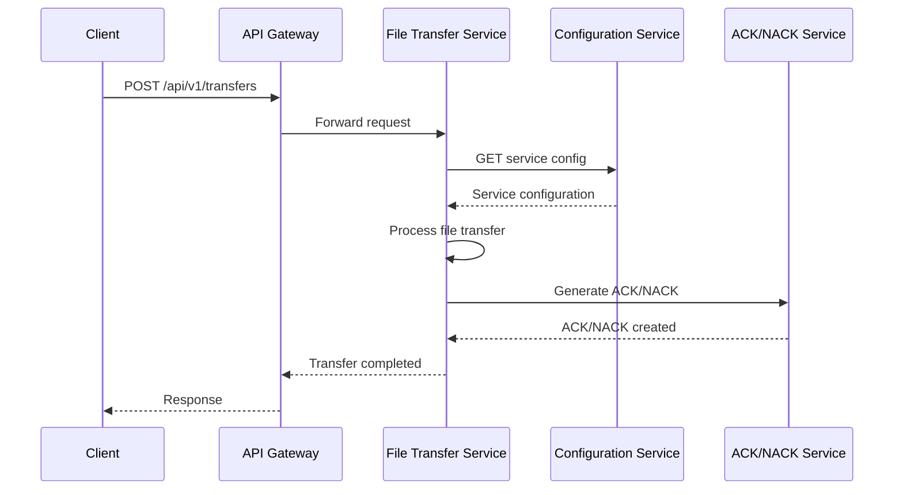

# File Transfer System - Microservices Architecture Documentation

## 1. Microservices Overview

### 1.1 Architecture Evolution
The File Transfer Management System has evolved from a modular monolith to a microservices architecture to support:
- **Scalability**: Independent scaling of services based on load
- **Resilience**: Fault isolation and graceful degradation
- **Technology Diversity**: Service-specific technology choices
- **Team Autonomy**: Independent development and deployment cycles
- **Cloud-Native**: Optimized for Kubernetes and cloud platforms

### 1.2 Service Decomposition Strategy

#### Domain-Driven Design Approach
```
┌─────────────────────────────────────────────────────────────────┐
│                      Business Domains                           │
├─────────────────────────────────────────────────────────────────┤
│  File Transfer Domain    │  Configuration Domain │  Auth Domain │
│  - File processing       │  - Service config     │  - User mgmt │
│  - ACK/NACK handling    │  - Schema mgmt        │  - SSO       │
│  - Status tracking      │  - Tenant mgmt        │  - RBAC      │
│                         │                       │              │
│  Analytics Domain       │  Notification Domain  │  Audit Domain│
│  - Metrics collection   │  - Alert mgmt         │  - Logging   │
│  - Reporting           │  - Multi-channel      │  - Compliance│
│  - Business Intel      │  - Event processing   │  - Tracing   │
└─────────────────────────────────────────────────────────────────┘
```

## 2. Service Catalog

### 2.1 Core Business Services

#### File Transfer Service
```yaml
Service Name: file-transfer-service
Port: 8081
Purpose: Core file transfer operations and processing
Technology: Spring Boot 3, Spring Batch
Database: Azure SQL MI (filetransfer schema)
Storage: Azure Blob Storage + Local PVC

Responsibilities:
  - File monitoring and detection
  - File transfer processing
  - Status tracking and updates
  - ACK/NACK generation
  - Batch job orchestration

API Endpoints:
  - POST /api/v1/transfers
  - GET /api/v1/transfers/{id}
  - PUT /api/v1/transfers/{id}/status
  - POST /api/v1/transfers/{id}/retry
  - GET /api/v1/transfers/search

Dependencies:
  - Configuration Service (service configs)
  - Notification Service (alerts)
  - Audit Service (logging)

Health Check: /actuator/health
Metrics: /actuator/prometheus
```

#### Configuration Service
```yaml
Service Name: configuration-service
Port: 8080
Purpose: Centralized configuration management
Technology: Spring Boot 3, Spring Data JPA
Database: Azure SQL MI (config schema)

Responsibilities:
  - Service configuration CRUD
  - Schema management
  - Tenant configuration
  - Feature flags
  - Configuration validation

API Endpoints:
  - GET /api/v1/config/services/{tenantId}
  - POST /api/v1/config/services
  - PUT /api/v1/config/services/{id}
  - GET /api/v1/config/schemas/{tenantId}
  - POST /api/v1/config/validate

Dependencies:
  - Authentication Service (user context)
  - Audit Service (change tracking)

Configuration Refresh: /actuator/refresh
Circuit Breaker: Hystrix enabled
```

#### ACK/NACK Service
```yaml
Service Name: ack-nack-service
Port: 8082
Purpose: Acknowledgment file processing and management
Technology: Spring Boot 3, Spring Batch
Database: Azure SQL MI (ack_nack schema)
Storage: Azure Blob Storage

Responsibilities:
  - ACK/NACK file generation
  - Partner ACK/NACK reception
  - Status tracking and monitoring
  - Expiration and cleanup
  - Partner communication

API Endpoints:
  - POST /api/v1/ack-nack/generate/{type}/{fileId}
  - POST /api/v1/ack-nack/upload
  - GET /api/v1/ack-nack/{tenantId}
  - GET /api/v1/ack-nack/statistics/{tenantId}
  - POST /api/v1/ack-nack/send-pending/{tenantId}

Dependencies:
  - File Transfer Service (file status)
  - Configuration Service (partner paths)
  - Notification Service (alerts)

Batch Jobs:
  - ACK/NACK file processing
  - Automatic generation
  - Partner file sending
  - Cleanup and expiration
```

### 2.2 Platform Services

#### Authentication Service
```yaml
Service Name: authentication-service
Port: 8083
Purpose: User authentication and authorization
Technology: Spring Boot 3, Spring Security, OAuth2
Database: Azure SQL MI (auth schema)
Cache: Redis (session storage)

Responsibilities:
  - User authentication (SSO)
  - JWT token management
  - Role-based access control
  - Session management
  - Multi-tenant user isolation

API Endpoints:
  - POST /api/v1/auth/login
  - POST /api/v1/auth/logout
  - POST /api/v1/auth/refresh
  - GET /api/v1/auth/user
  - POST /api/v1/auth/sso/{provider}

SSO Providers:
  - Azure Active Directory
  - Google Workspace
  - Okta
  - Custom OIDC/SAML

Security Features:
  - JWT with RS256 signing
  - Refresh token rotation
  - Rate limiting
  - Brute force protection
```

#### Notification Service
```yaml
Service Name: notification-service
Port: 8084
Purpose: Multi-channel notification and alerting
Technology: Spring Boot 3, RabbitMQ
Database: Azure SQL MI (notification schema)
Message Queue: RabbitMQ

Responsibilities:
  - Alert rule processing
  - Multi-channel notifications
  - Event correlation
  - Notification history
  - Template management

Notification Channels:
  - Email (SMTP)
  - Microsoft Teams (Webhook)
  - Slack (Webhook)
  - SMS (Twilio)
  - Push Notifications

API Endpoints:
  - POST /api/v1/notifications/send
  - GET /api/v1/notifications/history/{tenantId}
  - POST /api/v1/notifications/rules
  - GET /api/v1/notifications/templates

Event Sources:
  - File transfer events
  - ACK/NACK events
  - System health events
  - User activity events
```

#### Analytics Service
```yaml
Service Name: analytics-service
Port: 8085
Purpose: Data analytics and business intelligence
Technology: Spring Boot 3, Apache Kafka, ClickHouse
Database: ClickHouse (time-series data)
Stream Processing: Apache Kafka

Responsibilities:
  - Real-time metrics collection
  - Historical data analysis
  - Business intelligence reports
  - Performance monitoring
  - Trend analysis

API Endpoints:
  - GET /api/v1/analytics/dashboard/{tenantId}
  - GET /api/v1/analytics/reports/{tenantId}
  - POST /api/v1/analytics/custom-query
  - GET /api/v1/analytics/metrics/real-time
  - GET /api/v1/analytics/export/{format}

Data Sources:
  - File transfer events
  - User activity logs
  - System performance metrics
  - Business KPIs
```

### 2.3 Infrastructure Services

#### API Gateway
```yaml
Service Name: api-gateway
Port: 8080
Purpose: Single entry point and traffic management
Technology: Spring Cloud Gateway
Load Balancer: Nginx Ingress Controller

Responsibilities:
  - Request routing
  - Load balancing
  - Rate limiting
  - Authentication delegation
  - Response aggregation
  - Circuit breaking

Routing Rules:
  - /api/v1/transfers/** → file-transfer-service
  - /api/v1/config/** → configuration-service
  - /api/v1/ack-nack/** → ack-nack-service
  - /api/v1/auth/** → authentication-service
  - /api/v1/notifications/** → notification-service
  - /api/v1/analytics/** → analytics-service

Cross-Cutting Concerns:
  - Request/Response logging
  - Correlation ID injection
  - Security headers
  - CORS handling
  - API versioning
```

#### Service Mesh (Istio)
```yaml
Service Mesh: Istio
Purpose: Service-to-service communication management
Features:
  - Mutual TLS (mTLS)
  - Traffic management
  - Security policies
  - Observability
  - Fault injection

Components:
  - Envoy Proxy (sidecar)
  - Pilot (traffic management)
  - Citadel (security)
  - Galley (configuration)
  - Mixer (telemetry)

Configuration:
  - Virtual Services
  - Destination Rules
  - Service Entries
  - Authorization Policies
  - Telemetry v2
```

## 3. Service Communication Patterns

### 3.1 Synchronous Communication

#### REST API Communication


#### Service-to-Service Authentication
```java
@Configuration
public class ServiceToServiceAuthConfig {
    
    @Bean
    public RestTemplate serviceRestTemplate() {
        RestTemplate restTemplate = new RestTemplate();
        
        // Add service authentication interceptor
        restTemplate.getInterceptors().add(new ServiceAuthenticationInterceptor());
        
        // Add circuit breaker
        restTemplate.getInterceptors().add(new CircuitBreakerInterceptor());
        
        return restTemplate;
    }
}

@Component
public class ServiceAuthenticationInterceptor implements ClientHttpRequestInterceptor {
    
    @Value("${service.auth.token}")
    private String serviceToken;
    
    @Override
    public ClientHttpResponse intercept(
            HttpRequest request, 
            byte[] body, 
            ClientHttpRequestExecution execution) throws IOException {
        
        request.getHeaders().add("Authorization", "Bearer " + serviceToken);
        request.getHeaders().add("X-Service-Name", "file-transfer-service");
        request.getHeaders().add("X-Correlation-ID", getCorrelationId());
        
        return execution.execute(request, body);
    }
}
```

### 3.2 Asynchronous Communication

#### Event-Driven Architecture with Apache Kafka
```java
// Event publishing
@Service
public class FileTransferEventPublisher {
    
    @Autowired
    private KafkaTemplate<String, Object> kafkaTemplate;
    
    public void publishFileTransferCompleted(FileTransferCompletedEvent event) {
        kafkaTemplate.send("file-transfer-completed", event.getFileTransferId().toString(), event);
    }
    
    public void publishFileTransferFailed(FileTransferFailedEvent event) {
        kafkaTemplate.send("file-transfer-failed", event.getFileTransferId().toString(), event);
    }
    
    public void publishAckNackGenerated(AckNackGeneratedEvent event) {
        kafkaTemplate.send("ack-nack-generated", event.getAckNackId().toString(), event);
    }
}

// Event consumption
@Service
public class NotificationEventListener {
    
    @KafkaListener(topics = "file-transfer-completed")
    public void handleFileTransferCompleted(FileTransferCompletedEvent event) {
        // Generate success notification
        notificationService.sendSuccessNotification(event);
    }
    
    @KafkaListener(topics = "file-transfer-failed")
    public void handleFileTransferFailed(FileTransferFailedEvent event) {
        // Generate failure alert
        alertService.sendFailureAlert(event);
    }
    
    @KafkaListener(topics = "ack-nack-generated")
    public void handleAckNackGenerated(AckNackGeneratedEvent event) {
        // Send ACK/NACK to partner
        partnerIntegrationService.sendAckNackToPartner(event);
    }
}
```

#### Saga Pattern for Distributed Transactions
```java
@Component
public class FileTransferSaga {
    
    @SagaOrchestrationStart
    public void handleFileTransferRequest(FileTransferRequestEvent event) {
        // Step 1: Validate file
        commandGateway.send(new ValidateFileCommand(event.getFileId()));
    }
    
    @SagaHandler
    public void handle(FileValidatedEvent event) {
        if (event.isValid()) {
            // Step 2: Process file
            commandGateway.send(new ProcessFileCommand(event.getFileId()));
        } else {
            // Compensate: Generate NACK
            commandGateway.send(new GenerateNackCommand(event.getFileId(), event.getValidationErrors()));
        }
    }
    
    @SagaHandler
    public void handle(FileProcessedEvent event) {
        // Step 3: Generate ACK
        commandGateway.send(new GenerateAckCommand(event.getFileId()));
    }
    
    @SagaHandler
    public void handle(AckGeneratedEvent event) {
        // Step 4: Send to partner
        commandGateway.send(new SendAckToPartnerCommand(event.getAckId()));
    }
    
    @SagaHandler
    public void handle(FileProcessingFailedEvent event) {
        // Compensating action: Generate NACK
        commandGateway.send(new GenerateNackCommand(event.getFileId(), event.getErrorMessage()));
    }
}
```

## 4. Service Discovery and Configuration

### 4.1 Service Discovery Implementation

#### Kubernetes Service Discovery
```yaml
# Service definition for file-transfer-service
apiVersion: v1
kind: Service
metadata:
  name: file-transfer-service
  labels:
    app: file-transfer-service
    version: v1.0.0
spec:
  selector:
    app: file-transfer-service
  ports:
  - name: http
    port: 8081
    targetPort: 8081
  - name: actuator
    port: 8091
    targetPort: 8091
  type: ClusterIP
  
---
# ServiceMonitor for Prometheus scraping
apiVersion: monitoring.coreos.com/v1
kind: ServiceMonitor
metadata:
  name: file-transfer-service-monitor
spec:
  selector:
    matchLabels:
      app: file-transfer-service
  endpoints:
  - port: actuator
    path: /actuator/prometheus
    interval: 30s
```

#### Service Registration with Spring Cloud
```java
@SpringBootApplication
@EnableEurekaClient
@EnableConfigServer
public class ConfigurationServiceApplication {
    public static void main(String[] args) {
        SpringApplication.run(ConfigurationServiceApplication.class, args);
    }
}

// Service configuration
@Configuration
public class ServiceDiscoveryConfig {
    
    @Bean
    @LoadBalanced
    public RestTemplate loadBalancedRestTemplate() {
        return new RestTemplate();
    }
    
    @Bean
    public DiscoveryClient discoveryClient() {
        return new EurekaDiscoveryClient();
    }
}

// Service client with load balancing
@Service
public class ConfigurationServiceClient {
    
    @Autowired
    @LoadBalanced
    private RestTemplate restTemplate;
    
    public ServiceConfiguration getServiceConfig(String tenantId, String serviceName) {
        String url = "http://configuration-service/api/v1/config/services/{tenantId}/{serviceName}";
        return restTemplate.getForObject(url, ServiceConfiguration.class, tenantId, serviceName);
    }
}
```

### 4.2 Distributed Configuration Management

#### Spring Cloud Config Server
```yaml
# Configuration service application.yml
spring:
  cloud:
    config:
      server:
        git:
          uri: https://github.com/company/file-transfer-config
          default-label: main
          search-paths: '{application}'
        encrypt:
          enabled: true
          key-store:
            location: classpath:config-server.jks
            password: ${CONFIG_SERVER_KEYSTORE_PASSWORD}
            alias: config-server-key

  profiles:
    active: git,vault

# Vault integration for secrets
  cloud:
    vault:
      host: ${VAULT_HOST:localhost}
      port: ${VAULT_PORT:8200}
      scheme: https
      authentication: KUBERNETES
      kubernetes:
        role: file-transfer-config
        service-account-token-file: /var/run/secrets/kubernetes.io/serviceaccount/token
```

#### Client Configuration
```java
// Configuration client in each service
@RefreshScope
@ConfigurationProperties(prefix = "file-transfer")
@Component
public class FileTransferServiceConfig {
    
    private boolean enabled;
    private int pollIntervalSeconds;
    private AckNackConfig ackNack;
    private PartnerConfig partner;
    
    // Configuration classes with validation
    @Valid
    public static class AckNackConfig {
        @NotBlank
        private String basePath;
        
        @Min(1) @Max(168)
        private int timeoutHours;
        
        private boolean autoGenerate;
        
        // Getters and setters with validation
    }
    
    @Valid
    public static class PartnerConfig {
        @NotEmpty
        private Map<String, PartnerSettings> partners;
        
        // Partner-specific settings
    }
}
```

## 5. Data Management in Microservices

### 5.1 Database Per Service Pattern

#### Service-Specific Schemas
```sql
-- File Transfer Service Schema
CREATE SCHEMA file_transfer;
USE file_transfer;

CREATE TABLE file_transfer_records (
    -- File transfer specific tables
);

-- Configuration Service Schema  
CREATE SCHEMA configuration;
USE configuration;

CREATE TABLE service_configurations (
    -- Configuration specific tables
);

-- ACK/NACK Service Schema
CREATE SCHEMA ack_nack;
USE ack_nack;

CREATE TABLE ack_nack_records (
    -- ACK/NACK specific tables
);

-- Authentication Service Schema
CREATE SCHEMA authentication;
USE authentication;

CREATE TABLE users (
    -- Authentication specific tables
);
```

#### Cross-Service Data Access
```java
// Event sourcing for cross-service data consistency
@Entity
@Table(name = "domain_events", schema = "events")
public class DomainEvent {
    @Id
    private String id;
    private String aggregateId;
    private String eventType;
    private String eventData;
    private LocalDateTime timestamp;
    private String serviceName;
    private Long version;
}

// Event store service
@Service
public class EventStoreService {
    
    public void saveEvent(DomainEvent event) {
        eventRepository.save(event);
        // Publish to event bus
        eventBus.publish(event);
    }
    
    public List<DomainEvent> getEventsForAggregate(String aggregateId) {
        return eventRepository.findByAggregateIdOrderByVersion(aggregateId);
    }
    
    // Event replay for service recovery
    public void replayEvents(String serviceName, LocalDateTime since) {
        List<DomainEvent> events = eventRepository
            .findByServiceNameAndTimestampAfter(serviceName, since);
        
        for (DomainEvent event : events) {
            eventBus.publish(event);
        }
    }
}
```

### 5.2 Data Consistency Patterns

#### Eventual Consistency with Outbox Pattern
```java
@Entity
@Table(name = "outbox_events")
public class OutboxEvent {
    @Id
    private String id;
    private String aggregateId;
    private String eventType;
    private String eventData;
    private LocalDateTime createdAt;
    private boolean processed;
}

@Service
@Transactional
public class FileTransferService {
    
    public void completeFileTransfer(Long fileTransferId) {
        // Business logic
        FileTransferRecord record = updateFileTransferStatus(fileTransferId, TransferStatus.COMPLETED);
        
        // Create outbox event
        OutboxEvent event = new OutboxEvent();
        event.setAggregateId(fileTransferId.toString());
        event.setEventType("FileTransferCompleted");
        event.setEventData(toJson(new FileTransferCompletedEvent(record)));
        
        outboxRepository.save(event);
    }
}

// Outbox publisher
@Component
public class OutboxEventPublisher {
    
    @Scheduled(fixedDelay = 5000) // Every 5 seconds
    public void publishOutboxEvents() {
        List<OutboxEvent> unpublishedEvents = outboxRepository.findByProcessedFalse();
        
        for (OutboxEvent event : unpublishedEvents) {
            try {
                kafkaTemplate.send(event.getEventType(), event.getEventData());
                event.setProcessed(true);
                outboxRepository.save(event);
            } catch (Exception e) {
                logger.error("Failed to publish event {}: {}", event.getId(), e.getMessage());
            }
        }
    }
}
```

## 6. Resilience Patterns

### 6.1 Circuit Breaker Implementation

#### Resilience4j Configuration
```java
@Configuration
public class ResilienceConfig {
    
    @Bean
    public CircuitBreakerConfig circuitBreakerConfig() {
        return CircuitBreakerConfig.custom()
            .failureRateThreshold(50)
            .waitDurationInOpenState(Duration.ofSeconds(30))
            .slidingWindowSize(10)
            .minimumNumberOfCalls(5)
            .permittedNumberOfCallsInHalfOpenState(3)
            .build();
    }
    
    @Bean
    public RetryConfig retryConfig() {
        return RetryConfig.custom()
            .maxAttempts(3)
            .waitDuration(Duration.ofSeconds(2))
            .retryOnException(ex -> ex instanceof HttpServerErrorException)
            .build();
    }
    
    @Bean
    public TimeLimiterConfig timeLimiterConfig() {
        return TimeLimiterConfig.custom()
            .timeoutDuration(Duration.ofSeconds(10))
            .build();
    }
}

// Service with resilience patterns
@Service
public class ConfigurationServiceClient {
    
    @CircuitBreaker(name = "configService", fallbackMethod = "getDefaultConfig")
    @Retry(name = "configService")
    @TimeLimiter(name = "configService")
    public CompletableFuture<ServiceConfiguration> getServiceConfigAsync(String tenantId, String serviceName) {
        return CompletableFuture.supplyAsync(() -> {
            return restTemplate.getForObject(
                "http://configuration-service/api/v1/config/services/{tenantId}/{serviceName}",
                ServiceConfiguration.class, tenantId, serviceName);
        });
    }
    
    public CompletableFuture<ServiceConfiguration> getDefaultConfig(String tenantId, String serviceName, Exception ex) {
        logger.warn("Using default configuration for {}/{}: {}", tenantId, serviceName, ex.getMessage());
        
        ServiceConfiguration defaultConfig = new ServiceConfiguration();
        defaultConfig.setTenantId(tenantId);
        defaultConfig.setServiceName(serviceName);
        defaultConfig.setActive(true);
        
        return CompletableFuture.completedFuture(defaultConfig);
    }
}
```

### 6.2 Bulkhead Pattern

#### Resource Isolation
```java
@Configuration
public class BulkheadConfig {
    
    @Bean("fileProcessingExecutor")
    public Executor fileProcessingExecutor() {
        ThreadPoolTaskExecutor executor = new ThreadPoolTaskExecutor();
        executor.setCorePoolSize(5);
        executor.setMaxPoolSize(10);
        executor.setQueueCapacity(100);
        executor.setThreadNamePrefix("FileProcessing-");
        executor.initialize();
        return executor;
    }
    
    @Bean("ackNackProcessingExecutor")  
    public Executor ackNackProcessingExecutor() {
        ThreadPoolTaskExecutor executor = new ThreadPoolTaskExecutor();
        executor.setCorePoolSize(3);
        executor.setMaxPoolSize(6);
        executor.setQueueCapacity(50);
        executor.setThreadNamePrefix("AckNackProcessing-");
        executor.initialize();
        return executor;
    }
    
    @Bean("notificationExecutor")
    public Executor notificationExecutor() {
        ThreadPoolTaskExecutor executor = new ThreadPoolTaskExecutor();
        executor.setCorePoolSize(2);
        executor.setMaxPoolSize(4);
        executor.setQueueCapacity(25);
        executor.setThreadNamePrefix("Notification-");
        executor.initialize();
        return executor;
    }
}
```

## 7. Monitoring and Observability

### 7.1 Distributed Tracing

#### OpenTelemetry Implementation
```java
@Configuration
public class TracingConfig {
    
    @Bean
    public OpenTelemetry openTelemetry() {
        return OpenTelemetrySdk.builder()
            .setTracerProvider(
                SdkTracerProvider.builder()
                    .addSpanProcessor(BatchSpanProcessor.builder(
                        JaegerGrpcSpanExporter.builder()
                            .setEndpoint("http://jaeger-collector:14250")
                            .build())
                        .build())
                    .setResource(Resource.getDefault()
                        .merge(Resource.create(
                            Attributes.of(ResourceAttributes.SERVICE_NAME, "file-transfer-service"))))
                    .build())
            .build();
    }
}

// Custom tracing annotations
@Target({ElementType.METHOD})
@Retention(RetentionPolicy.RUNTIME)
public @interface Traced {
    String operationName() default "";
    String[] tags() default {};
}

@Aspect
@Component
public class TracingAspect {
    
    @Around("@annotation(traced)")
    public Object traceMethod(ProceedingJoinPoint joinPoint, Traced traced) throws Throwable {
        Span span = tracer.nextSpan()
            .name(traced.operationName().isEmpty() ? 
                  joinPoint.getSignature().getName() : 
                  traced.operationName())
            .start();
        
        try (Tracer.SpanInScope ws = tracer.withSpanInScope(span)) {
            // Add custom tags
            for (String tag : traced.tags()) {
                span.tag(tag, "true");
            }
            
            return joinPoint.proceed();
        } catch (Exception e) {
            span.tag("error", e.getMessage());
            throw e;
        } finally {
            span.end();
        }
    }
}
```

### 7.2 Centralized Logging

#### Structured Logging Configuration
```java
// Logback configuration for microservices
// logback-spring.xml
<configuration>
    <include resource="org/springframework/boot/logging/logback/defaults.xml"/>
    
    <appender name="STDOUT" class="ch.qos.logback.core.ConsoleAppender">
        <encoder class="net.logstash.logback.encoder.LoggingEventCompositeJsonEncoder">
            <providers>
                <timestamp/>
                <logLevel/>
                <loggerName/>
                <message/>
                <mdc/>
                <arguments/>
                <pattern>
                    <pattern>
                        {
                            "service": "file-transfer-service",
                            "version": "1.0.0",
                            "correlationId": "%X{correlationId:-}",
                            "tenantId": "%X{tenantId:-}",
                            "userId": "%X{userId:-}"
                        }
                    </pattern>
                </pattern>
            </providers>
        </encoder>
    </appender>
    
    <root level="INFO">
        <appender-ref ref="STDOUT"/>
    </root>
</configuration>

// MDC (Mapped Diagnostic Context) filter
@Component
public class CorrelationIdFilter implements Filter {
    
    @Override
    public void doFilter(ServletRequest request, ServletResponse response, FilterChain chain)
            throws IOException, ServletException {
        
        HttpServletRequest httpRequest = (HttpServletRequest) request;
        
        String correlationId = httpRequest.getHeader("X-Correlation-ID");
        if (correlationId == null) {
            correlationId = UUID.randomUUID().toString();
        }
        
        MDC.put("correlationId", correlationId);
        MDC.put("serviceName", "file-transfer-service");
        
        try {
            chain.doFilter(request, response);
        } finally {
            MDC.clear();
        }
    }
}
```

## 8. Security in Microservices

### 8.1 Service-to-Service Security

#### mTLS with Istio
```yaml
# Istio PeerAuthentication for mTLS
apiVersion: security.istio.io/v1beta1
kind: PeerAuthentication
metadata:
  name: default
  namespace: file-transfer
spec:
  mtls:
    mode: STRICT

---
# Authorization policy
apiVersion: security.istio.io/v1beta1
kind: AuthorizationPolicy
metadata:
  name: file-transfer-authz
  namespace: file-transfer
spec:
  selector:
    matchLabels:
      app: file-transfer-service
  rules:
  - from:
    - source:
        principals: ["cluster.local/ns/file-transfer/sa/api-gateway"]
  - to:
    - operation:
        methods: ["GET", "POST", "PUT"]
        paths: ["/api/v1/*"]
```

#### JWT Token Validation
```java
@Component
public class JwtTokenValidator {
    
    @Value("${jwt.public-key}")
    private String publicKey;
    
    public boolean validateToken(String token) {
        try {
            Algorithm algorithm = Algorithm.RSA256(getPublicKey(), null);
            JWTVerifier verifier = JWT.require(algorithm)
                .withIssuer("file-transfer-auth-service")
                .build();
            
            DecodedJWT jwt = verifier.verify(token);
            
            // Additional validation
            return !isTokenExpired(jwt) && 
                   hasRequiredClaims(jwt) &&
                   isValidAudience(jwt);
                   
        } catch (JWTVerificationException e) {
            logger.warn("JWT validation failed: {}", e.getMessage());
            return false;
        }
    }
    
    public String extractTenantId(String token) {
        try {
            DecodedJWT jwt = JWT.decode(token);
            return jwt.getClaim("tenantId").asString();
        } catch (Exception e) {
            logger.error("Failed to extract tenant ID from token: {}", e.getMessage());
            return null;
        }
    }
}
```

### 8.2 API Gateway Security

#### Rate Limiting and Security Headers
```java
@Configuration
public class GatewaySecurityConfig {
    
    @Bean
    public RedisRateLimiter redisRateLimiter() {
        return new RedisRateLimiter(10, 20, 1); // 10 requests per second, burst of 20
    }
    
    @Bean
    public RouteLocator customRouteLocator(RouteLocatorBuilder builder) {
        return builder.routes()
            .route("file-transfer-service", r -> r
                .path("/api/v1/transfers/**")
                .filters(f -> f
                    .requestRateLimiter(c -> c
                        .setRateLimiter(redisRateLimiter())
                        .setKeyResolver(userKeyResolver()))
                    .addRequestHeader("X-Forwarded-Service", "api-gateway")
                    .addResponseHeader("X-Content-Type-Options", "nosniff")
                    .addResponseHeader("X-Frame-Options", "DENY")
                    .addResponseHeader("X-XSS-Protection", "1; mode=block"))
                .uri("lb://file-transfer-service"))
            .build();
    }
    
    @Bean
    public KeyResolver userKeyResolver() {
        return exchange -> exchange.getRequest().getHeaders().getFirst("X-User-ID");
    }
}
```

## 9. Deployment Architecture

### 9.1 Kubernetes Deployment Strategy

#### Helm Chart Structure
```
helm/
├── Chart.yaml
├── values.yaml
├── values-production.yaml
├── values-staging.yaml
├── templates/
│   ├── configmap.yaml
│   ├── secret.yaml
│   ├── deployment.yaml
│   ├── service.yaml
│   ├── ingress.yaml
│   ├── servicemonitor.yaml
│   ├── poddisruptionbudget.yaml
│   └── horizontalpodautoscaler.yaml
└── charts/
    ├── file-transfer-service/
    ├── configuration-service/
    ├── ack-nack-service/
    ├── authentication-service/
    ├── notification-service/
    └── api-gateway/
```

#### Production Deployment Configuration
```yaml
# values-production.yaml
global:
  environment: production
  registry: acr.azurecr.io/filetransfer
  imageTag: "1.0.0"
  
services:
  fileTransferService:
    replicaCount: 3
    resources:
      requests:
        memory: "1Gi"
        cpu: "500m"
      limits:
        memory: "2Gi"
        cpu: "1000m"
    autoscaling:
      enabled: true
      minReplicas: 2
      maxReplicas: 10
      targetCPUUtilizationPercentage: 70
      targetMemoryUtilizationPercentage: 80
    
  configurationService:
    replicaCount: 2
    resources:
      requests:
        memory: "512Mi"
        cpu: "250m"
      limits:
        memory: "1Gi"
        cpu: "500m"
    
  ackNackService:
    replicaCount: 2
    resources:
      requests:
        memory: "512Mi"
        cpu: "250m"
      limits:
        memory: "1Gi"
        cpu: "500m"

database:
  host: file-transfer-sqlmi.database.windows.net
  port: 1433
  name: filetransfer-prod
  ssl: true
  
storage:
  type: azureBlob
  containerName: file-transfer-prod
  
monitoring:
  prometheus:
    enabled: true
  grafana:
    enabled: true
  jaeger:
    enabled: true
```

### 9.2 CI/CD Pipeline for Microservices

#### Azure DevOps Pipeline
```yaml
# azure-pipelines.yml
trigger:
  branches:
    include:
    - main
    - develop
  paths:
    include:
    - file-transfer-web/*
    - file-transfer-batch/*
    - file-transfer-frontend/*

variables:
  containerRegistry: 'filetransfer.azurecr.io'
  imageRepository: 'file-transfer'
  dockerfilePath: '$(Build.SourcesDirectory)/Dockerfile'
  tag: '$(Build.BuildId)'

stages:
- stage: Build
  displayName: Build and Test
  jobs:
  - job: BuildServices
    displayName: Build All Services
    pool:
      vmImage: 'ubuntu-latest'
    strategy:
      matrix:
        WebService:
          serviceName: 'file-transfer-web'
          dockerfile: 'file-transfer-web/Dockerfile'
        BatchService:
          serviceName: 'file-transfer-batch'
          dockerfile: 'file-transfer-batch/Dockerfile'
        Frontend:
          serviceName: 'file-transfer-frontend'
          dockerfile: 'file-transfer-frontend/Dockerfile'
    steps:
    - task: Docker@2
      displayName: Build and push image
      inputs:
        command: buildAndPush
        repository: $(imageRepository)-$(serviceName)
        dockerfile: $(dockerfile)
        containerRegistry: $(containerRegistry)
        tags: |
          $(tag)
          latest

- stage: Deploy
  displayName: Deploy to AKS
  dependsOn: Build
  condition: and(succeeded(), eq(variables['Build.SourceBranch'], 'refs/heads/main'))
  jobs:
  - deployment: DeployToProduction
    displayName: Deploy to Production
    pool:
      vmImage: 'ubuntu-latest'
    environment: 'production'
    strategy:
      runOnce:
        deploy:
          steps:
          - task: HelmDeploy@0
            displayName: Deploy with Helm
            inputs:
              connectionType: 'Azure Resource Manager'
              azureSubscription: 'Azure-Production'
              azureResourceGroup: 'file-transfer-rg'
              kubernetesCluster: 'file-transfer-aks'
              namespace: 'file-transfer-prod'
              command: 'upgrade'
              chartType: 'FilePath'
              chartPath: 'helm/file-transfer'
              releaseName: 'file-transfer'
              valueFile: 'helm/file-transfer/values-production.yaml'
              overrideValues: |
                global.imageTag=$(tag)
                global.environment=production
```

## 10. Testing Strategy for Microservices

### 10.1 Contract Testing

#### Spring Cloud Contract
```groovy
// contracts/file-transfer-service/get-transfer-by-id.groovy
Contract.make {
    description "should return file transfer by ID"
    
    request {
        method GET()
        url value(consumer(regex('/api/v1/transfers/[0-9]+')), 
                 producer('/api/v1/transfers/123'))
        headers {
            contentType(applicationJson())
            header('Authorization', 'Bearer valid-jwt-token')
            header('X-Tenant-ID', 'test-tenant')
        }
    }
    
    response {
        status OK()
        headers {
            contentType(applicationJson())
        }
        body(
            id: 123,
            fileName: "test-file.dat",
            serviceName: "TEST_SERVICE",
            status: "COMPLETED",
            direction: "INBOUND",
            tenantId: "test-tenant"
        )
    }
}
```

#### Consumer-Driven Contract Testing
```java
// Consumer test (ACK/NACK Service)
@SpringBootTest
@AutoConfigureStubRunner(ids = "com.filetransfer:file-transfer-service:+:stubs:8081")
class FileTransferServiceContractTest {
    
    @Autowired
    private FileTransferServiceClient fileTransferServiceClient;
    
    @Test
    void should_get_file_transfer_by_id() {
        // Given
        Long fileTransferId = 123L;
        
        // When
        FileTransferRecord transfer = fileTransferServiceClient.getFileTransfer(fileTransferId);
        
        // Then
        assertThat(transfer).isNotNull();
        assertThat(transfer.getId()).isEqualTo(123L);
        assertThat(transfer.getFileName()).isEqualTo("test-file.dat");
        assertThat(transfer.getStatus()).isEqualTo(TransferStatus.COMPLETED);
    }
}
```

### 10.2 Integration Testing

#### TestContainers for Integration Testing
```java
@SpringBootTest
@Testcontainers
class FileTransferServiceIntegrationTest {
    
    @Container
    static PostgreSQLContainer<?> postgres = new PostgreSQLContainer<>("postgres:13")
            .withDatabaseName("testdb")
            .withUsername("test")
            .withPassword("test");
    
    @Container
    static GenericContainer<?> redis = new GenericContainer<>("redis:6-alpine")
            .withExposedPorts(6379);
    
    @Container
    static KafkaContainer kafka = new KafkaContainer(DockerImageName.parse("confluentinc/cp-kafka:latest"));
    
    @DynamicPropertySource
    static void configureProperties(DynamicPropertyRegistry registry) {
        registry.add("spring.datasource.url", postgres::getJdbcUrl);
        registry.add("spring.datasource.username", postgres::getUsername);
        registry.add("spring.datasource.password", postgres::getPassword);
        registry.add("spring.redis.host", redis::getHost);
        registry.add("spring.redis.port", redis::getFirstMappedPort);
        registry.add("spring.kafka.bootstrap-servers", kafka::getBootstrapServers);
    }
    
    @Test
    void testFileTransferProcessingFlow() {
        // Create test file
        createTestFile("/test/input/test-file.dat", "test content");
        
        // Trigger file processing
        fileMonitoringService.monitorDirectories();
        
        // Wait for processing to complete
        await().atMost(30, SECONDS).until(() -> 
            fileTransferRepository.findByFileName("test-file.dat")
                .stream()
                .anyMatch(record -> record.getStatus() == TransferStatus.COMPLETED)
        );
        
        // Verify ACK generation
        List<AckNackRecord> ackRecords = ackNackRepository.findByType(AckNackType.ACK);
        assertThat(ackRecords).hasSize(1);
        assertThat(ackRecords.get(0).getStatus()).isEqualTo(AckNackStatus.GENERATED);
    }
}
```

This comprehensive microservices architecture documentation provides detailed implementation guidance for transforming the File Transfer Management System into a cloud-native, scalable microservices platform.